# 数据分析行业案例(Excel实战)

## 课程主要内容

### 第一部分：Excel基础

### 第二部分：业务场景实战--分析方法应用

### 第三部分：数据透视表

### 第四部分：数据看板

### 第五部分：总结

## 第一部分： Excel基础

#### 1.1 查看Excel 版本

点击【文件】，找到【账户】，即可查看当前Excel版本。

#### 1.2 快速访问工具栏

1. 添加按钮到快速访问工具栏，如升序、降序

​       方法：点击▼，勾选升序排序和降序排序

​		添加后如下图：

​		没有出现在下拉菜单中的按钮也可以通过【更多命令】添加到快速访问工具栏中，自己尝试添加。

#### 1.3 快速定位菜单功能按钮

1.  技巧1

- 处理同一类问题的按钮一般会放在同一个菜单中

- 开始：单元格设置（字体，对齐方式，样式等）

- 插入：插入各类对象（图表，形状，链接，切片器)

- 页面布局：打印及显示整体布局（页面设置，主题颜色）

- 公式：数据计算相关（函数，自定义名称等）

- 数据：数据处理分析相关

- 审阅： 校对审核（用的比较少）

- 视图：Excel显示方式调整

  

2. 技巧2

   功能相关的按钮总是出现在相近的地方，如【开始】菜单中，

3. 检验：

- 合并单元格的按钮在【开始】菜单
- 排序的按钮在【数据】菜单
- 显示比例的按钮在【视图】菜单
- 文本框的按钮在【插入】菜单
- 自动求和的按钮在【公式】菜单
- 去掉网格线的按钮在【视图】菜单
- ......

#### 1.4 添加或移除菜单选项卡

1. 【文件】-->【选项】-->【自定义功能区】
1.  右侧列表区内进行勾选即可

#### 1.5 添加或移除菜单中的功能按钮

1. 【文件】-->【选项】-->【自定义功能区】

1. 左侧功能栏按钮，【添加】，菜单中功能按钮新加

1. 右侧功能栏按钮，【删除】，菜单中功能按钮移除

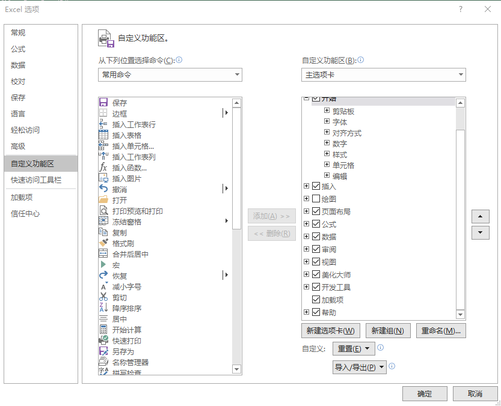

#### 1.6. 编辑栏

1. 单元格地址名称

1. 差号为取消编辑（Esc)， 对号为确认编辑（Enter),  fx 为插入函数

1. 编辑框

#### 1.7  工作区

1. 列标签

2. 行号

3. 行，列 ，单元格

#### 1.8 快速找到某个工作表

​	当一个工作簿中，包含很多个工作表时，底标签会显示不全而自动隐藏，

​	如何快速找到想要的工作表呢？

1. 鼠标右键点击工作簿左下角区域处，出现激活页面卡

2. 双击想要查看的工作表，即可跳转过去

#### 1.9 固定首行

​	在浏览内容较多的表格时，向下拉动滚动条，首行标题就找不到了，如何固定首行呢？

1. 固定首行，是改变显示问题，所以可以在【视图】选项卡中寻找相关功能

2. 选择【冻结首行】即可，其他冻结方式也可尝试一下。

#### 1.10 自动生成编号

​	如何为员工编排顺序号？

1. 在A2单元格输入1，A3单元格输入2，同时选中这两个单元格

2. 移动鼠标到选定区域右下角，鼠标指针指针变成 "+"，按鼠标左键往下拖，如果行数过多，双击鼠标左键即可完成填充。

3. 带字母的连续编号也可以用这种方式填充，操作步骤同上。

4. 在录入电话号码信息时，同一个地区前面的区号是相同的，如“010-2033234、010-2020123”，表示北京地区号码。这里可以通过设置单元格格式，在每次输入的时候，区号可以自动补全。提高录入效率。

   可以右键“设置单元格格式” 的“自定义”  在类型下文本框录入“010-”@。

#### 1.11 输入时显示提示信息

​	在输入信息时，如何能出现提示信息，按要求输入？

1. 选定C列，在【数据】选项卡中，点击【数据验证】

2. 弹出框选择【输入信息】，勾选显示，在【标题】、【输入信息】中输入相应内容，【确定】

3. 如下图，输入日期时机会提示输入的格式。

#### 1.12 地址引用

1. 相对引用

   对商品做8折促销活动，需要计算不同货号折后的价格

- 选中C2单元格，输入公式：=B2*0.8

- 回车

- 鼠标双击C2单元格右下角出现的 "+"，完成填充

​    公式在向下复制的过程中，对B2单元格的引用也发生了变化，引用地址依次变为B3、B4、B5...

这种变化具有相对位移的特点，叫做相对引用。

1. 绝对引用

- 很多情况下，折扣往往会有波动，所以需要当促销折扣发生变动时，不需要修改公式就可以更新

- 在E2单元格输入折扣数值，然后在C2单元格输入公式：=B2*$E$2

   回车

- 鼠标双击C2单元格右下角出现的 "+"，完成填充

​    在E和2的前面都加上$符号，表示对E2单元格的绝对引用，因此在乡下复制的过程中

E2单元格引用位置始终保持不变，这种保持对单元格的固定引用使其不随公式复制而变化

的方式称为绝对引用。

- 如果E2单元格中的折扣发生变化（改为0.7，回车），折后价也会同步更新。

​    相对引用和绝对引用的核心就是正确理解$符号（绝对引用符）的作用，可以将它理解为一把锁，

放到行号或列标的前面，可以将其锁定，在复制的过程中，不再发生位移变化。

1. 混合引用

   只锁行，或者只锁列

   来个小测试：

实现如下乘法表

1. 输入1后，按住Ctrl 键向右或下进行拖拽，形成第一行第一列的1-9

1. 在行1 和 列1 对应的交叉点写入公式 =if($A2>=B$1,$A2*B$1,"")

#### 1.13 常用快捷键

选定整张工作表：Ctrl+A

复制选定的单元格：Ctrl+C

剪切选定的单元格：Ctrl+X

粘贴复制的单元格：Ctrl+V

撤销上一次操作：Ctrl+Z

新建Excel文件：Ctrl + N 

打开文件：Ctrl + O 

打印工作表：Ctrl + P 

键入公式：=（等号）

绝对引用 - 加锁：F4

选定整列：Ctrl+空格键

选定整行：Shift+空格键

在单元格中换行：Alt+Enter

取消单元格输入：Esc

完成单元格输入并向右选取下一个单元格：Tab

完成单元格输入并向下选取下一个单元格：Enter 

插入超链接：Ctrl+K

复制上一单元格内容：Ctrl+D

复制左一单元格内容：Ctrl+R

范围选取：Ctrl+Shift+箭头

强大的学习快捷键：Ctrl + E

神奇的快捷键：Alt + M

## 第二部分：业务场景实战--分析方法应用

#### 2.1 运用对比分析法解决哪类产品销售好的问题？

- 需求确认

   明确数据中需要比较的指标，何种方式比较，什么指标之间比较。

- 数据收集

   依据业务指标和计算口径，进行数据收集。

- 数据处理：统计（excel 工具实现）

   知识点：excel 去重筛选   

   1.【数据】-->【高级筛选】-->选择“将筛选结果复制到其他位置”，列表区域选中D列，

​     指定复制到的位置，勾选“选择不重复记录”。

  	 2.统计各品类的总销售量（sumif(范围，条件，求和项）

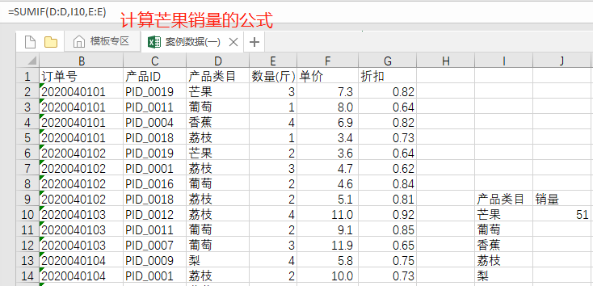

   	3.设施统计表格格式（字体，背景色等）

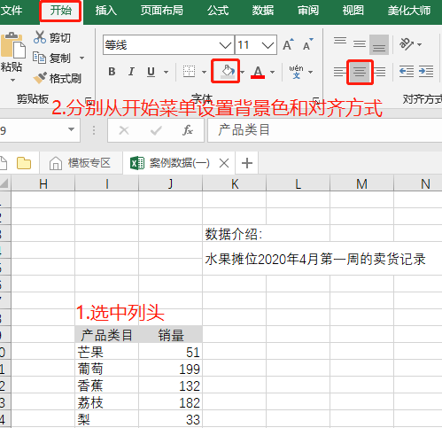

- 数据分析： 对比分析（图表更直接----可视化）
- 知识点：为各品类绘制对比图（柱形图）
   1. 选中左侧所有数据 -->【插入】--> 图表区域选择柱形图。

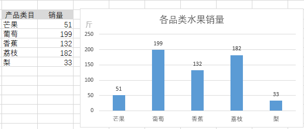

2. 选中图表右键添加数据标签（Excel 右侧可以设置图标样式）。

3. 问题扩展：计算每天的总销售额，每单的总销售额。

#### 2.2 运用趋势分析法分析水果总需求如何？

​    趋势是市场表现的方向，趋势分析可以帮助我们把握市场大方向，不犯原则性错误。

​    趋势有三种方式：上升，下降和平稳  

​    纵向分析:不同时间的段指标进行比较

- 需求确认：

​	比较的指标：订单量 ，重量， 销售额  

​	比较的时间粒度： 时，天，月，年

- 数据收集：

  依据确认的指标和计算口径

  数据处理： 统计（excel 工具实现）

1.数据量少的情况下，我们选择时间粒度为日。excel 去重筛选所有时间段 

【数据】-->【高级筛选】--> 列表区域选择日期列

   

   2.统计每天的销售量并设置表格式 （sumif(范围，条件，求和项)）              

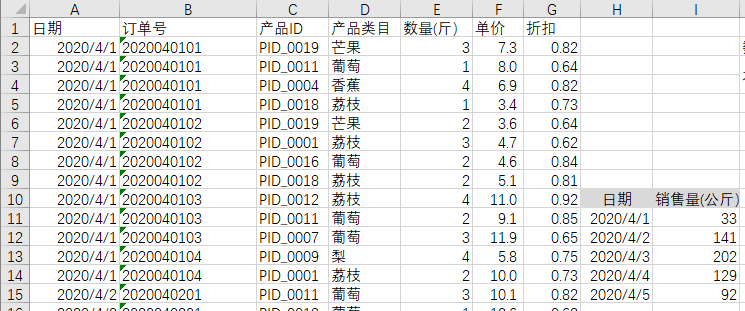

- 数据分析： 趋势分析（图表更直接----可视化）-- 时间段趋势用折线图表示

   1.【插入】-->【图表区】--> 选择“带数据标记折线图”（时间段少时用）

   2.选中图表对象，右侧菜单设置图表进行美化

   3.问题扩展 

- 分析4月第一周各类水果的需求情况
- 计算每日的客单价  客单价 = 总销售额/订单数

#### 2.3 对各品类进行分组找到销量额和利润都低的品类---矩阵关联法(象限分析法)

​    矩阵分析法:是指将事物的两个重要指标作为分析的依据，进行分类关联分析，找出解决问题的一种分析方法，也称为矩阵关联分析法，简称矩阵分析法。

1.  每次营销活动的点击率和转化率

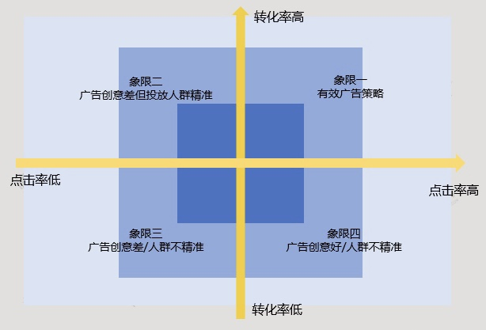

2. 各类服装库存与销量

3. 用户对产品重要性与满意度

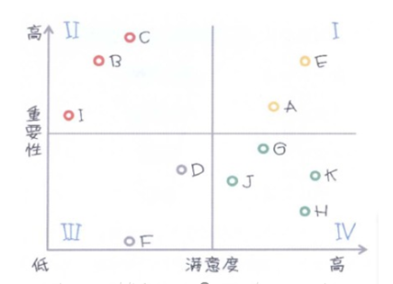

 作用：1. 将有相同特征的事件进行归因分析，总结其中的共性原因

​         2. 建立分组优化策略

- 需求确认：

​       指标体系（销售额，销售量 ，毛利润等）

​       销售额高和平均利润都高：重点对待

​       销售额高但是平均利润少：一般保持

​       销售额低但是平均利润高：重点发展

​       销售额和平均利润双低：需要查明原因或下架或辅助重点发展的品类

- 数据收集:

​       依据确认的指标和计算口径获取数据

 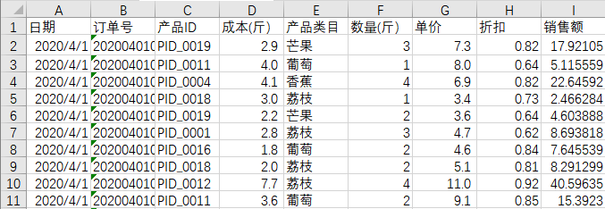

- 数据处理： 统计（excel 工具实现） 

​    1. 计算每单各水果的 利润=销售额- 成本 * 销售量

2. excel 去重筛选所有品类   数据菜单--高级筛选

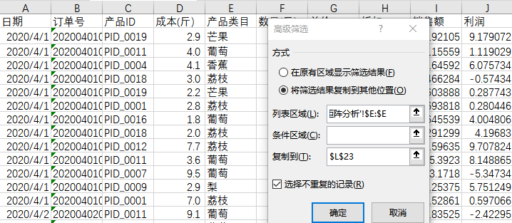

3. 统计销售额（sumif)  

4. 统计总销量(sumif)

5. 统计总利润(sumif)

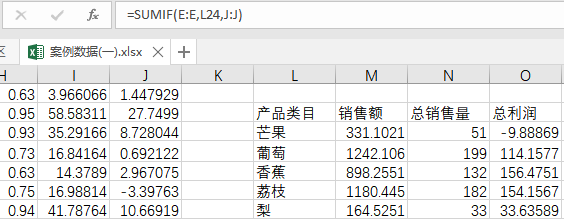

​    6. 计算平均利润

​         

 

- 数据分析： 象限分析（图表更直接----可视化）

​       知识点：象限图（散点图改进）

1. 选中销售额和平均利润数据绘制散点图

2. 计算销售额与平均利润的平均值

   

3. 调整散点图的X,Y轴交叉点为销售额和利润的均值，之变为矩阵图

   

4. 去掉散点图的X,Y轴刻度    

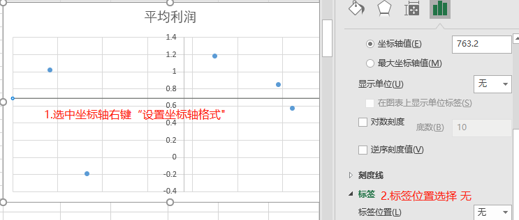

5. 选中横纵网格线，按下“del”键删除网格

6. 添加坐标轴的标题，便于区分各象限的含义

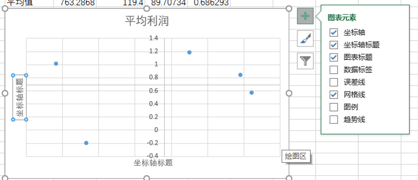

7. 设置数据标签

​     a.选中图表右键"添加数据标签"

​     b.选中标签右键“数据标签选项”--选中单元格的值并框选所有产品类目，去掉Y值

8. 最终展现结果如下

9. 可以看出芒果的销售额、利润都不高，可以将精力放到其他 芒果的销量上

10. 小结

​      只要两个指标之间线性无关且放在一起有意义都可以用象限分析    

​      如：转化率和客单价   

​          售罄率和单款产出     

​          单款库存深度(数量）和 上新款数    

 

#### 2.4 小结一

统计函数（求和类函数）

- sum(求和范围) 求指定范围的数据之和

- sumif(条件范围,条件) 条件求和

- sumifs  （求和范围,条件范围1,条件1,条件范围2,条件2....) 同时符合多条件对应的单元格合计

统计函数（计数类函数）

- count(数据范围） 单元格内容为数值的单元格个数

- counta(数据范围） 非空单元格个数

- countblank(数据范围） 空单元格个数

- countif(条件范围，条件)

- countifs  (条件范围1，条件1，条件范围2，条件2)

统计函数（平均类函数）

- average(数据范围)

- averageif(条件范围，条件，求平均范围）

- averageifs(求平均范围,条件范围1,条件1,条件范围2,条件2)同时符合多条件对应的单元格的平均值

补充：

Countif,Sumif “懒惰”比较解决方法(countif,sumif 条件比较是只比较前15位)

解决方法： 使用通配符  * 

1. 利用Countif ，Sumif 解决限制条件录入
2. 利用countif限制重复录入
3. 利用sumif解决出库单问题

#### 2.5 销售团队4月消毒液销售情况分析---分组分析（分布情况）

- 需求确认： 

   对各销量段的人数做对比  确定几个销量段(组数），各段如何划分

- 数据收集：

   依据确认的指标和计算口径

- 数据处理： 统计（excel 工具实现）

   1. 确定组数后计算组距：（最大值-最小值）/ 组数

2. 最小值和组距设计组

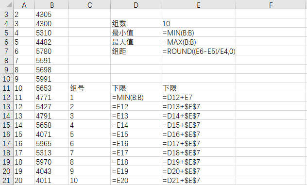

​           

3. 计算各组频数（countif,frequency)--重叠组上限不在内。

- 数据分析：分组分析（图表更直接----可视化）

   1. 设计好组名  字符串连接 公式如： D12 &  "~"  &E12

   2. 选中组名和频数两列数据 插入--“图表区”的柱形图

#### 2.6 分析培训班的各环节转化情况---产品用户行为分析(漏斗分析）

- 需求理解：

   1. 确定各环节及各环节计算口径

      环节： 浏览（浏览时长大于30秒的）
   
   ​       申请试听（电话联系确认时间）

​              试听（试听时间20分钟）

​              报名（合同签订）

2. 确定计算各环节转化率或总转化率

3. 时间窗口是 ：根据业务实际情况来，可以天 周  月等           

- 数据收集：

   依据确认的指标和计算口径

- 数据处理： 统计（excel 工具实现）

   1. 计算各环节人数计算公式如下图

2. 计算各环节转化率

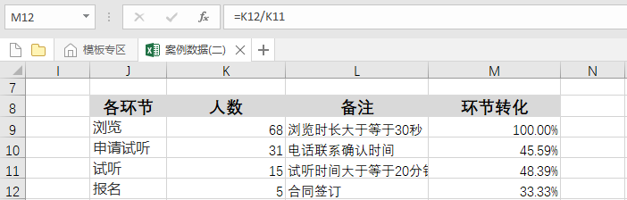

​     

- 数据分析： 漏斗分析（图表更直接----可视化）

   由于漏斗图不能选择绘图数据外的数据作为数据标签，所以选择堆积条形图。

   1. 计算在人数前占位符

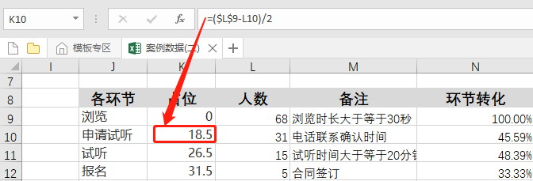

2. 选中各环节 占位 人数及数据后“插入”菜单--图表--“堆积条形图”
3. 选中Y轴右键“设置坐标轴格式”---勾选“逆序类别”

   

4. 选中人数（橙色）条形图右键“添加数据标签”，数据标签右键"设置数据标签格式”---勾选“单元格中的值”---选中“各环节转化率”的数据

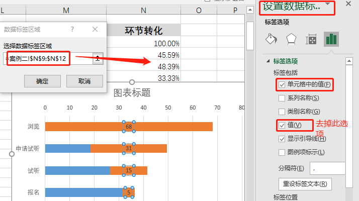

   

5. 选中蓝色条图右键“填充”--选择无填充

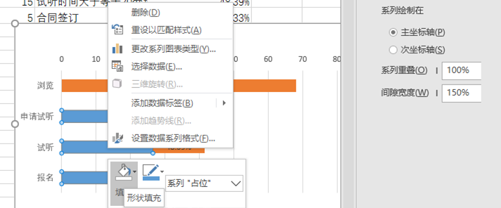

6. 最终漏斗图

   常见问题：最终指标与实际不一样: 有其他路径到达报名（如口碑介绍）

​     

#### 2.7 数据涨跌异动分析---问题拆解（逻辑树）

 

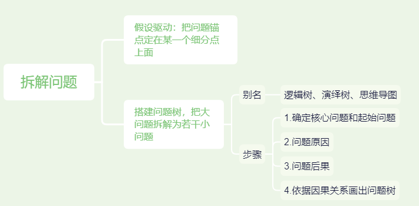

- 发现异常（销售额是上升的，但毛利额却在下降）

   确定问题： 周同比， 月同比，年同比

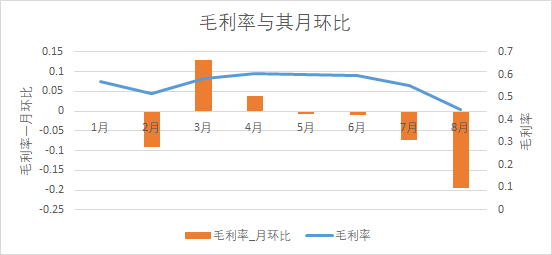

   从图示得出8月毛利润出现异常，确认问题不属于正常波动。        

- 确定原因：逻辑树问题拆解

   1. 问题拆解

2. 产品较多我们从渠道类型出发（发现8月数据免费渠道是销售额高但利润低）

3. 下钻免费渠道内的明细渠道（发现8月数据流量宝是高销售额低利润的）

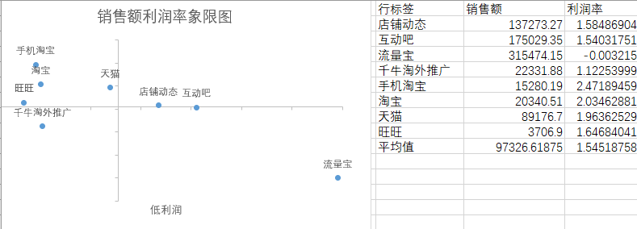

4. 调取流量宝明细与其他部门配合解决此问题

#### 2.8 小结二

1. 通过left 提取字母 US或 CN ，通过IF判断国家。

     说明：if(条件,条件为真时的返回值,条件为假时的返回值)

      		  left(字符串，长度) 从字符串左侧截取指定长度

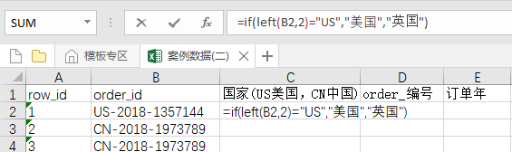

2. 通过right 提取订单编号 order_id的后7位

     说明：right(字符串，长度) 从字符串右侧截取指定长度

3. 通过mid 和 find 提取 order_id中间的年份

     说明：mid(字符创，开始位置，长度)从字符串指定位置开始截取指定长度

   ​    		 find(找什么，从哪个字符串里找,从哪里开始找) 在指定字符中从指定位置开始找，返回第一次出现的位置

4. 通过right  len lenb 截取数据的单位

     说明：len(字符串)  返回字符串中字符个数

   ​    		 lenb(字符串) 返回字符串中字节个数

5. 通过substitute字符串替换实现数值提取

     说明：substitute(要处理的字符串,要替换掉的字符串,新字符串,[替换第几个])  字符串替换

6. 通过rept 和 len 函数 对编号进行修正

   ​	说明：rept(字符串，重复次数）  把字符串重复几次

#### 2.9 渠道排名---综合分析

​    渠道的数量指标(访问数，页面浏览数）

​    渠道的质量指标(ROI，到达率，跳出率，页面停留时间，浏览深度，用户访问频数)

- 需求确认：

   确认要考察的指标及计算口径

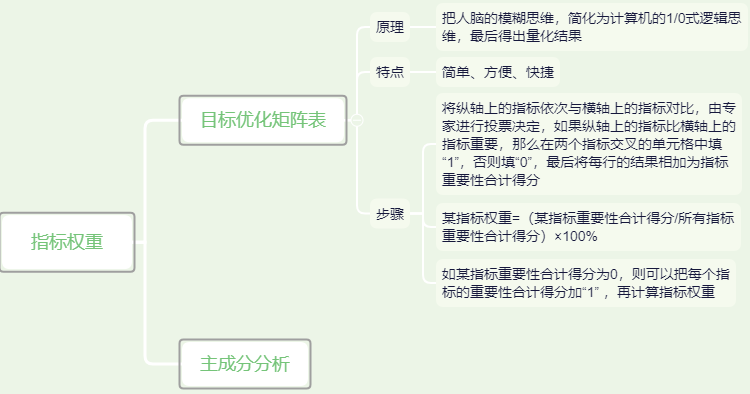

​    

​	目标优化矩阵方式确认指标权重

​          

- 收集数据：

   依据指标体系及计算口径收集数据

- 数据处理：

   数据标准化（去除量纲影响）

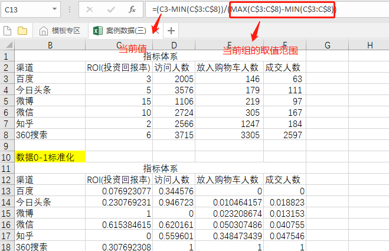

​    

- 数据分析 

   1. 利用指标权重和标准化后数据计算综合得分（ MMULT(数据范围1，数据范围2)）

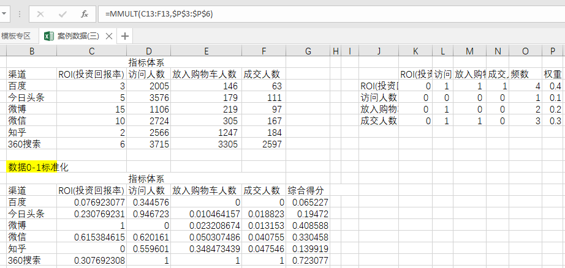

2. 对各渠道进行排名（rank(数据，数据范围)）

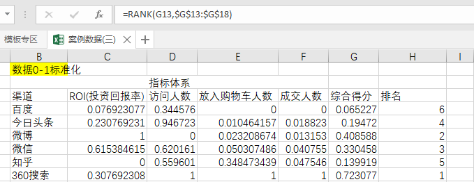

#### 2.10 电商用户价值分析---RFM建模

- 需求确认：

   用户划分几类， 时间窗口期， R的单位是月/日

   R确定几个阶段， F确定几个阶段， M确定几个阶段

- 数据收集：

   根据用户的窗口期收集订单数据（用户ID， 订单日期，订单金额）

- 数据处理：

   窗口期我们定义为2018-2019 两年，对数据进行筛选

   1. 选中第一行列头 ，点击“数据“菜单--“筛选” 对order_date 选中2016-2017两年的数据，

2. 选中2016,2017的数据把这两年的数据删除掉

   

   从数据看出，现在是订单详情数据，一个单子有多个商品，首先要对订单进行数据汇总

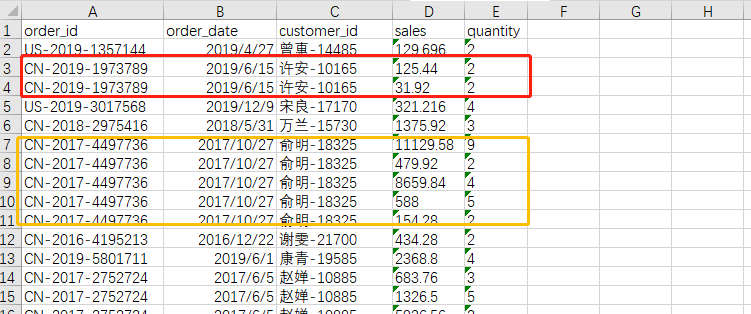

1. 订单数据汇总（order_id, order_date,coustomer_id,sales）

   【数据】-->【高级筛选】 --> 筛选出去重的订单号

2. 通过vlookup指令，以Order_id 找到其对应的 order_date和customer_id

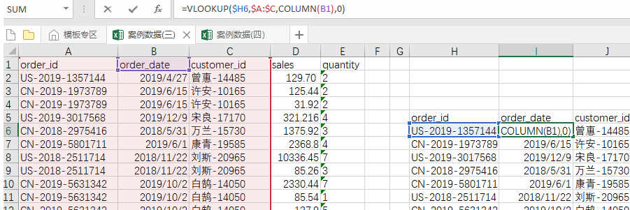

3. 通过sumif 指令， 以Order_id 汇总其对应的 Sales 之和

- 数据分析：

  【数据】--> 【高级筛选】 --> 筛选出去重的customer_id

1. 计算用户最后一次购买距离2019-12-31号有多少天(date,minifs)

2. 计算两年内各用户购买的频次（countif）

3. 计算两年内各用户购买的总金额（sumif）

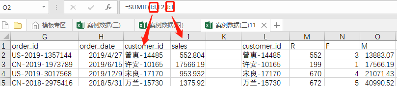

   RFM模型3各指标，每个指标分为两个阶段，以均值作为分割点，计算均值（average）

1. 把各用户的R，F，M指标分别分为 R(远近） F(高低）  M(高低）以均值为界限（if）

2. 便于查找，在各用户后和价值表处分别加上复制列(&）

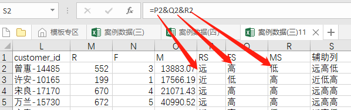

3. 从价值表中为用户获得用户类型（vlookup）

   从上图可以看出每个用户的类型就划分好了，2*2*2 八类用户，可以根据需求划分更多类型

结果产出： 

用户类型表单 +  用户类型占比图

   

#### 2.11 搭建数据分析师岗匹配模型---搭建指标体系模型

​	建立招聘信息模型，使招聘更规范化，对岗位需求更具有针对性。

​	公司计划招聘一名数据分析师，根据岗位需求确定基本信息(工作年限，学历） 技术能力(Python,Sql) 业务能力（运营，产品知识）

- 设计指标取值及分值口径

   确定指标体系后确定指标口径，这指标取值对应的分值。

- 确定指标权重及判断结果

   各指标在整个体系中重要程度有所差异，所以要确定指标权重，并创建结果判断标准。

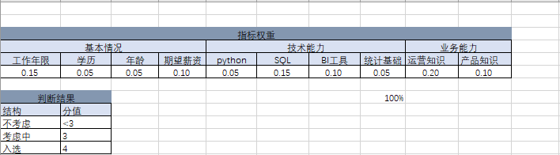

- 数据输入规范设置

   在数据交互区域“输入值”一行，依据指标字典设置相应的数据有效性

   1. 选中“B4” 点击 “数据”菜单---“数据验证” 为B4单元格加工作年限的输入录入限制  。

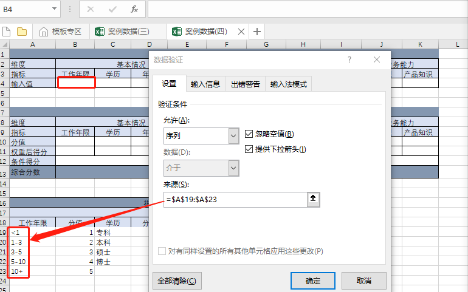

2. 设置单元格序列验证后单元格样式如下，其他指标验证实现方式一致。

   在数据结果区“分值”一行，依据指标值和指标字典得相应的分值

1. vlookup("1-3",工作年限和分值范围，范围分值列，精确查找)  其他各指标实现方式一致

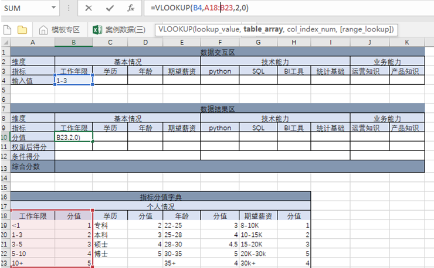

   在数据结果区“权重后得分” 进行相应指标权重 * 分值计算

1. 工作年限1-3年得分2 * 工作年限权重0.15 为 工作年限的权重后得分，其他各指标计算方式一致

   对指标体系3部分分别进行 权重后得分求和计算

1. 对B11:E11基本情况下各指标权重后得分求和，技术能力和业务能与其计算方式一致

   计算综合得分，并显示判断结果

1. 对三部分总分 sum(B12:K12) 用if进行结果判断

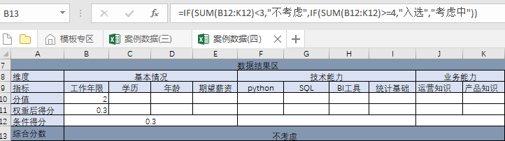

#### 2.12 小结三

2.12.1 查找引用   

函数说明：

​    match(找谁，从哪里找，怎么找)  查找并返回对应的位置

​    index(数据范围，行，[列]) 引用指定位置的单元格值

​    offset(相对位置，下移行数，右移列数，行数，列数)  引用指定范围的数据

​    offset要和定义名称合用实现动态图表  

举例：

​    offset 实现的动态图表如下

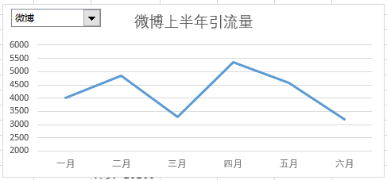

2.12.2 日期函数

函数说明：

​    DATEDIF（开始日期，结束日期，‘计算单位Y/M/D’）：计算两日期的单位差

-   NETWORKDAYS（开始日期，结束日期）：返回开始日期和结束日期之间的所有工作日数

​    TODAY（ ）：当前系统日期   

​    NOW() ：当前系统时间

​    WEEKDAY（日期,星期计算方式）：返回指定日期是周几

​    WEEKNUM（日期,星期计算方式）：返回指定日期一年中第几周

​    YEAR/MONTNH/DAY（日期）：返回指定日期的年/月/日数值

​    HOUR/MINUTE/SECOND（日期）：返回指定日期的时/分/秒数值

​    Date(YEAR，MONTNH，DAY）：返回指定年、月、日的日期

​    Time(HOUR,MINUTE,SECOND) ：返回指定时、分、秒的时间

以上公式的具体问题实现

各公式的运行结果

2.12.3 数据高级筛选

  Excel数据筛选不同字段只能实现并且关系，要想实现或者关系可以进行高级高级筛选

   实现或者条件的筛选 数据菜单——筛选“高级”

实现新计算字段 和 或者关系 

   先写好条件区域 新计算列的值是 = f2 >h2

  

2.12.4 数据验证

  数据验证的作用：单元格进行添加一些限制条件，保证数据的准确性。

- 选中要验证的单元格----数据菜单----数据验证

2.12.5 条件格式

  条件格式作用：按指定条件区别显示。

- 选中要处理的单元格 -->【开始】-->【条件格式】

2.12.6 其他普通图表与迷你图

  Excel 图表操作比较简单

1. 环形图 （占比的可视化，只考虑占比不要求数据精细的情况适用）

2. 条形图（当对比项多时，条形图比柱形图更常用）

3. 散点图（分析两组数值数据是否有关系）

4. 面积图（和折现图一样表达总体趋势，但面积图更强调数值随时间而变化的程度）

5. 雷达图（对比项目进行多维数据的对比）

6. 树状图(适合用来展示构成项目较多的结构关系,层级关系)

7. 箱线图

8. 组合图（多数是Y轴显示两个维度，但量纲差异较大的数据可视化，如数量和销售额）

9. 地图

10. 迷你图（单元格内做图示）

## 第三部分：数据透视表

#### 3.1 数据透视表定义

数据透视表:一种交互式的强大数据分析和汇总工具

#### 3.2 数据透视表要求

不能有空字段名。

不要有相同的字段名（自动给列加编号）。

字段名不能为有合并单元格。

#### 3.3 数据透视表的创建

1. 把光标定位到数据源任意位置

1. 选择数据菜单--插入数据透视表

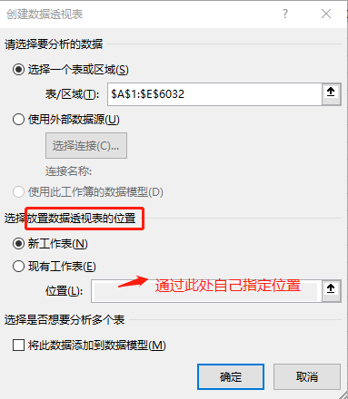

3. 数据透视表字段列表               

4. 向四个功能区拖拽字段创建透视表

#### 3.4 数据透视表布局（多行，多筛选，值，空白行）

3.4.1多行格式调整： 大纲格式改为表格格式（字段设置 + 经典布局+重复项目标签）

 透视表行区域中 “频道名称”--字段设置---“布局和打印”---勾选“以表格形式显示项目标签”         

透视表右键 ---“数据透视表选项” --“显示”选项卡 ---勾选“经典数据透视表”

透视表行区域中 “月”--字段设置---“布局和打印”---勾选“重复项目标签”

3.4.2多筛选格式调整：（数据透视表选【项布局和格式】）

透视表右键 ---“数据透视表选项” --“布局和格式”选项卡 --- 设置 在报表筛选区域显示字段 和 每列报表筛选字段数。

3.4.3统计方式及值格式调整：（值字段设置）

透视表值区域中 “销售额”--字段设置---“值汇总方式”---选择相应计算类型 并 通过数字格式 设置显示格式值显示格式

3.4.4空白行的处理

通过透视表行筛选出进行隐藏空白行

#### 3.5 数据透视表多维度计算（计算字段横向计算，计算项纵向计算)

3.5.1计算字段

作用：源数据不变的情况下进行新字段计算

方法：通过现有字段进行计算

3.5.2 计算项

作用：源数据不变的情况下进行新字段计算

方法：通过字段内容(具体数值）进行计算

注意：数据透视表中的字段不能自动或手动组合过，也不能应用于数据透视表中多次出现过的字段。

#### 3.6 数据透视表的切片器与日程（交互式展示，实现动态图表的效果）

3.6.1 切片器

1.选中通过选项调显示格式

2.选中右键-报表链接-控制多个透视表

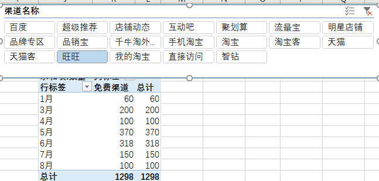

3.6.2 日程（选中通过选项调显示格式）

1.选中通过选项调显示格式

2.选中--选项菜单--报表链接-控制多个透视表

## 第四部分：数据看板

#### 4.1 数据看板的作用

​    1.可以从数据中获取信息

​    2.获得更多维度的分析

#### 4.2 制作数据看板的步骤

#### 4.3 电商销售分析看板

业务场景:某电商平台要监测商品销售情况，关键指标包含品类销售，用户类型，城市排行，商品特征等.

- 数据来源：2016-2019年平台销售数据

- 看板内容：设置年，季度 ，月份切片器，对销售额、销售量等进行统计分析，实现指标动态交互。

- 数据准备

以order_date计算出年、季度、 月数值

- 制作主要步骤

1.汇总各品类的销售金额并进行占比可视化（数据透视图），并通过文本框的形式吧总计放入环形图内。

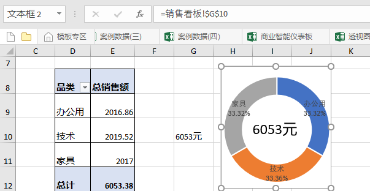

2.选中透视表插入年，月，日切片器并隐藏无数据项，调整切片器为横向。

3.分别插入城市Top10（透视表） 商品颜色或特色销售额（透视图），并用切片器联动控制。

#### 4.4 公众号监测仪表板

- 业务背景：公众号推广人员对公众号的用户量，稳健程度比较关心，每日需要实时查看关键指标（新关注人数，取消关注人数，净增关注人数等）

- 数据来源：2019/1/1公众号每日的关注人数，取消人数等信息，每日零点系统会自动把上一日数据追加到Excel 中,没条件的也可以手动录入这四个指标值。

- 仪表板制作主要步骤

1.获取昨天的各关键指标（vlookup函数）

2.计算日环比，周同比，月同比增长

新关注人数日环比增长公式：（（昨天-前天）/前天）

新关注人数日同比增长公式：（（昨天-上周的同一天）/上周的同一天）

新关注人数月同比增长公式：（（昨天-上月的同一天）/上月的同一天）

其他取消关注，净关注等日环比、周同比、月同比计算方式一样。

3.设置日环比，周同比，月同比增长图标显示

 【开始菜单】-->【条件格式】-->【图标集】-->【其他规则】

4.查看各指标走势

【开发工具】-->【插入】-->【表单空间】，选择【选项按钮】， 依次插入4个【选项按钮】，然后任一按钮右键单击，出现设置控制格式弹窗，选择【控制】-->【单元格链接】-->选中任一空白单元格。

根据选项按钮选择控制显示哪一指标，并且突出显示

选中第一个按钮上的“新关注人数”单元格，单击【开始】-->【条件格式】-->【新建格式规则】-->选择【使用公式确定要设置格式的单元格】，其他3个指标格式设置方式也一致。

设置趋势显示时间段，并放入到下拉列表中

【开发工具】--【插入】-->选中【列表框】，右键弹出【设置对象格式】页面卡 -->【控制】-->【数据源区域】选取数据源，【单元格链接】选取数据链接位置（用来记录选择的是列表框里第几个选项）

通过下拉列表框控制显示多少天的数据

定义指标offset 和时间offset，时间offset第三个参数为0即可

把指标和时间offset定义的公式加入到折线图中，指标仪表板如下

## 第五部分：总结

分享 Excel 思维导图

  函数： 统计函数， 条件函数， 查询函数，字符串函数，日期函数，数学函数

  筛选： 一般筛选 ，高级筛选 

  样式：条件格式

  数据约束： 数据验证

  汇总统计： 数据透视表

  