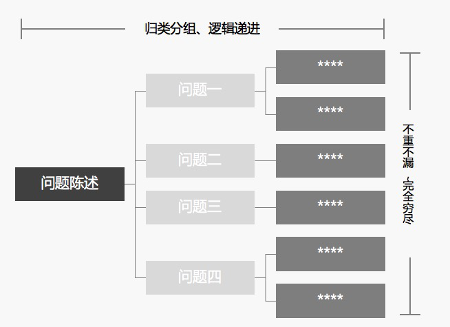
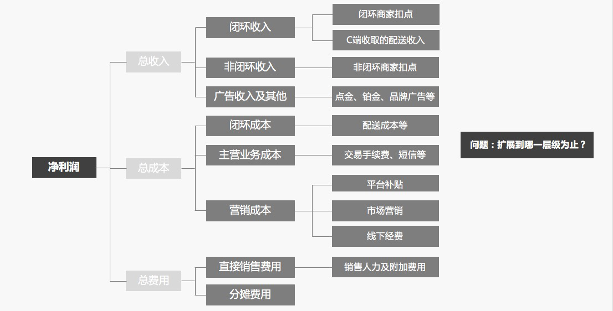
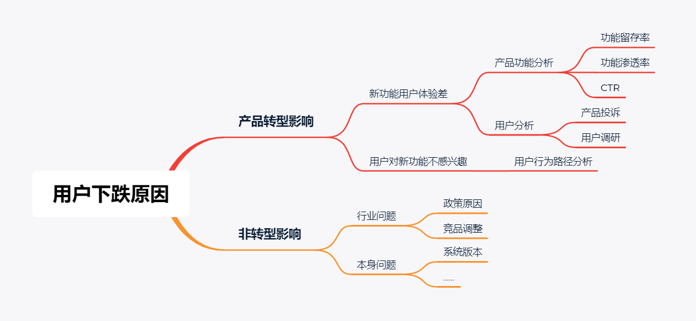
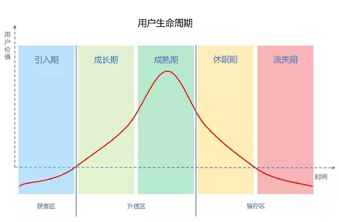
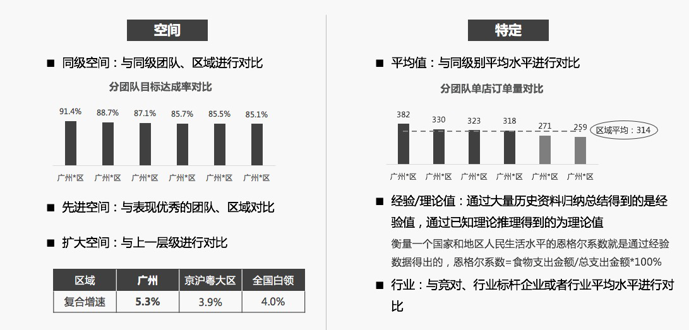
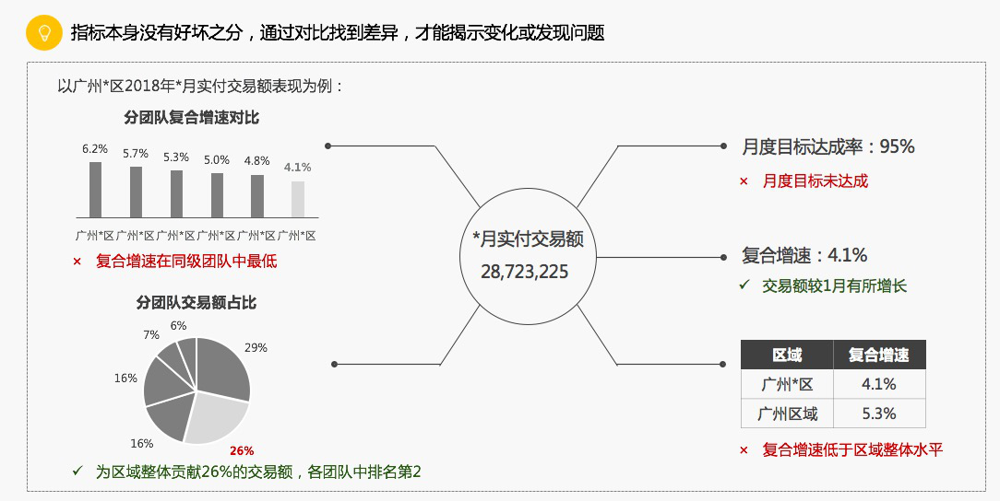
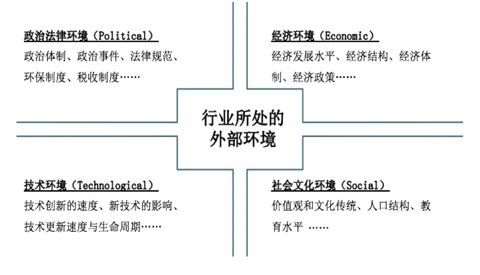

# 数据分析思维与业务流程

## 课程主要内容

- 第一节：数据分析概述
- 第二节：数据分析方法论和分析模型
- 第三节：实战案例讲解
- 第四节：本章小结

————————————————————————————————————

## 第一部分：数据分析概述

### 1.1 数据分析是什么

数据分析是在立足于业务的基础上，通过数据收集、清洗、处理、分析、建模、展示等方式，用于监控业务状态，分析方案效果，定位业务问题，最终实现优化业务，辅助决策制定的行为。

### 1.2 数据分析师做什么

- 实时疫情数据展示

- 电商用户画像

- 金融风险评估     

那说了这么多，数据分析师到底在做什么呢？，总结起来有以下三个方面：

- 描述现状。
- 发现规律。
- 推动改进。

### 1.3 数据分析主要流程

数据分析的主要流程可以总结为以下六个步骤：

1. 需求分析

   问题定位
   需求拆解；

2. 数据收集

   Mysql数据查询
   Hive的数据查询
   爬虫 （Python)；

3. 数据处理

   EXTRACT(提取)
   Transform(转换)
   LOAD(加载)；

4. 数据分析

   业务指标体系
   数据分析模型
   数据分析、统计分析方法；

5. 数据可视化

   tableau
   神策数据平台
   quick bi；

6. 数据分析报告

## 第二部分：数据分析方法论和分析模型

### 2.1 数据分析方法论

做好数据分析是有方法的，大家要学会在平时的工作过程中，针对不同的业务场景套用合适的方法和模型去解决。

#### 2.1.1 明确问题方法论——**5W2H**

梳理业务流程是一个挺复杂的过程，这个过程主要是以实际的业务场景为基础获取业务信息，然后抽象出一个以参与对象为节点的业务流程。用**5W2H**通过图等工具可以很方便的把业务梳理出来， 从而把问题明确。

**“如何分析用户是否是小学生？”**

1.WHY —— 为什么会有这样的问题？为什么需要分析小学生而不是大学生或者小学生的父母？

2.WHO —— 这个产品的小学生和普通理解的小学生有没有差别？什么样的小学生才会使用这个产品？

3.WHERE —— 每个地方的小学生是不是都有一样的特点？什么地方的小学生特点比较突出？小学生的位置信息是否会有特点？

4.WHEN —— 小学生一般什么时候用这个产品？频率如何？和其他用户有什么差异？

5.WHAT —— 小学生有什么与其他用户不同的特点？

6.HOW —— 可能会有什么解决方案？

7.HOW MUCH —— 这些解决方案影响有多大？什么方案最好？

#### 2.1.2 拆解问题方法论——逻辑树

·按照业务逻辑或者商业逻辑，把复杂问题拆解成若干个简单的子问题，像树枝一样逐步展开。

把已知的问题比作树干，然后考虑哪些问题或任务与已知问题有关，将这些问题或子任务比作逻辑树的树枝，一个大的树枝上还可以继续延伸出更小的树枝，逐步列出所有与已知问题相关联的问题。

**如何分析一家互联网知名的某贵金属电商平台网站利润？**

#### 2.1.3 定位问题原因方法论

当我们明确到某个具体指标出现问题后，通常我们需要定位问题的具体原因。

**如何分析某APP DAU逐渐下跌的原因**

### 2.2 业务指标体系

业务指标的定义：

​		对业务有参考价值的的统计数据。

业务指标的作用：

​         当企业确定发展目标时，就需要使用业务指标来量化发展目标。

#### 2.2.1 产品运营指标

- 北极星指标

#### 2.2.2 商业分析指标

### 2.3 数据分析模型

#### 2.3.1 如何进行用户分析

**1. 用户结构分析**

  用户结构一般包含以下几个方面的信息：

- 自然属性：年龄，性别，地域，

- 社会属性：学历，家庭状况，婚姻，子女等；

- 商业属性：财富等级，消费档次，信用等；

- 心理属性：价格敏感性、偏好属性等；

- 行为属性：浏览频次，浏览品类、浏览价格带、下单频次、下单品类、下单价格带等；

- 价值属性：ADR贡献等。

**2. 用户行为分析**

​    日常工作中，可以通过用户行为日志，将每一个用户的行为都标记出来，并且根据业务需要对行为进行标记。

**3. 用户价值分析**

用户价值体现在两个方面，当平台是售卖物品或售卖服务的平台，用户发生的交易数据可以体现用户价值；如果平台是以广告变现的平台，那么用户的广告价值则体现用户价值。

​    针对不同价值的用户进行分析，一般考虑如下方面：

- 购买金额：指在一段时间内累计的消费金额；

- 购买频次：指在一段时间内，购买的次数；

- 购买平均金额：指在一段时间内，平均每次消费的金额；

- 购买内容：指在一段时间内，购买商品或服务的属性；

- 复购频次：指在一段时间内，反复消费的次数；

- 复购间隔：指在一段时间内，每次复购行为之间的时间间隔；

- 复购内容：指在一段时间内，每次复购时购买的商品或服务的属性。

这里分享一些经验：

- 用户的交易数据经常会被忽略

- 行为+结果=心理。

- 不要单纯的把用户交易数据当作结果数据使用。比如，一个用户在第一次发生交易后，每隔一段时间就会继续发生交易，那么该用户就不能被简单的定义为普通用户，而应视为忠实用户。

#### 2.3.2 用户生命周期模型

​    用户生命周期，源自于传统营销学里面的客户生命周期一说，特别是在政治、经济、环境、社会等诸多领域经常出现，其基本涵义可以通俗地理解为“从摇篮到坟墓”（Cradle-to-Grave）的整个过程，在互联网行业中，用户的生命周期指的是：**用户接触你的产品到最后流失的整个过程。**

​    一般互联网生命周期包括：**引入期**、**成长期**、**成熟期**、**休眠期**和**流失期**5个周期。

​	1.引入期：指用户从下载到进入我们产品的时期。

​	2.成长期：一般用户成功使用产品或多次购买产品之后，便进入了成长期。

​	3.成熟期：指用户通过多次购买，成为了忠实用户，产品占领用户心智。

​	4.休眠期：用户在一定时间内，没有再次购买过平台产品。

​	5.流失期：用户超出设定的休眠期时间，没有购买过产品。

**1. 用户生命周期模型作用**

​    随着移动互联网的用户增长趋近饱和，获客成本越来越高，留住一个老用户的成本远比获取一个新用户的成本低，这使用户的留存就显得至关重要。而按照用户生命周期来划分用户，能够帮助我们了解不同生命周期的用户需求，开展运营策略，从而减少用户流失。

​    针对不同阶段的用户，采取针对性运营策略，从而**延长用户的生命周期**，**尽可能让用户产生商业价值**。在运营愈发精细化的当下，通过搭建用户生命周期体系，让运营工作更加精细化、效率化、产品化，对于提高平台运营的效果和效率至关重要。

​    在用户生命周期中有两个阶段要注意：

-  要缩短成长期
-  延长成熟期

**2. 用户生命周期运营策略**

​    五类用户生命周期

- **新客**
- **首次成交用户**
- **忠实用户**
- **潜在流失用户**
- **流失用户**

- ###### 引入期 -- 新客

​    目标：促成其完成首次成交。

​	手段：

​		1.MGM，老带新；

​		2.产品一定要下功夫打磨，做好用户留存。

- ###### 成长期 -- 首次成交用户

​    目标：提高用户的更多成交。

​	手段：

​		投入产品层面新客户专享的福利

- ###### 成熟期 -- 忠实用户

​    目标：让这部分用户持续购买。

​	手段：

​		1.大力度的营销活动；

​		2.有趣的小游戏

- ###### 休眠期 -- 潜在流失用户

​    目标：促活，

​	注意：

​		1.建立VIP专线及专人服务措施；

​		2.加强舆情监控、及时发现异动。

- ###### 流失期 -- 流失用户

​    用户流失是很容易被运营人员忽视的一个环节，而且也不能短时间内出效果，需要平时多研究，多尝试，多复盘。不仅要进行日常监测，还要对其采取运营措施，比如活动召回、push、短信、外呼等，不断复盘优化，形成体系。在重大营销时，可以尝试加大召回力度，效果好的也许会出乎意料。

#### **2.3.3 AARRR用户增长模型**

**1. AARRR模型概念及作用**

- 获取（Acquisition）
- 激活 （Activation）
- 留存（Retention）
- 收入（Revenue）
- 推荐（Referral）

**2. AARRR模型各环节说明**

**1.获取用户(Acquisition) -- 用户如何找到我们**

​    什么是渠道？

​	一是口碑渠道，适合病毒营销；

​	二是有机渠道，适合搜索引擎优化、内容营销；

​	三是付费渠道，比如电视广告、赞助。

另外，获取用户需要重点关注的指标：

1. 渠道曝光量：有多少人看到产品推广的线索
2. 
   渠道转换率：有多少用户因为曝光转化成用户

3. 日新增用户数：每天新增用户数

4. 日应用下载量：每天有多少用户下载该应用

5. 获客成本(CAC):获取一个用户所消耗的成本

**2.激活用户(Activation) -- 用户的首次体验如何**

​    什么是活跃？  

​                 **DAU = 当日新增 + 累计历史日留存**

​    分析角度：

​	1.活跃用户构成 

​	新用户数、老用户数、新老用户占比、新老用户活跃率、忠诚用户数、回流用户数、流失用户数、1次/1日登录用户占比等指标，根据不同产品运营时期，有不同的参考数值。

​	2.产品粘度。

​	**DAU/MAU** 

其他指标

​	1.日活跃用户数（简称日活）：一天之内，登录或使用某个产品的用户数。类似的还有周活跃用户数，月活跃用户数

​	2.活跃率（活跃用户占比）：某一时间段内活跃用户在总用户的占比。根据时间可分为日活跃率（DAU）、周活跃率（WAU）、月活跃率（MAU）等

​	3.用户流失率：用户流失率和留存率恰好相反，如果某产品新用户的次日留存为20%，那么反过来说明有80%的用户流失了

​	4.PV(PageView)是页面浏览量，用户每打开一个网页可以看作一个PV，用户看了十个网页PV为十。

​	5.UV（Unique Visitor,独立访客数）是一定时间内访问网页的人数，不管用户访问多少网页，他都只算一个独立访客，怎么确认用户是不是同一个人呢？技术上通过网页缓存cookie或者IP判断，如果这两者改变了，则用户算作全新的访客。

**3.用户留存(Retention) -- 用户会回来吗**

主要指标：

- **次日留存率**：（当天新增的用户中，在第二天使用过产品的用户数）/第一天新增的总用户数

- **第3日留存率**：(第一天新增的用户中，在第3天使用过产品的用户数)/第一天新增的总用户数

- **第7留存率：**（第一天新增的用户中，在第7天使用过产品的用户数）/第一天新增的总用户数

- **第30天留存率：**（第一天新增的用户中，在第30天使用过产品的用户数）/第一天新增的总用户数

提升活跃与留存4种方式：

 	1. **有效触达，唤醒用户**：
      
- 手机PUSH、短信和微信公众号推送
      
 	2. **搭建激励体系，留存用户**：
      
- 成长值会员体系、签到体系、积分任务体系等。
      
3. **丰富内容，增加用户在线时长**

 4. **数据反推，找到关键点**

    

**4.变现(Revenue) -- 如何赚到钱**

媒体类平台依靠广告变现

游戏类依靠用户付费

电商类通过收取佣金或卖家付费的方式。

指标：

**客单价：**每位用户平均购买商品的金额，客单价=销售总额/顾客总数。

**PUR：**（pay user rate） 付费用户占比。

**复购率：**一定时间内，消费两次以上的用户/总购买用户数，如果10个客户购买了商品，5个用户产生了重复购买，则复购率为50%。

还有ARPU、ARPPU、付费率（区分新老）、回购率等。

**5.产品推荐(Refer) -- 用户会告诉其他人吗**

指标：

**转发率**：转发的用户数/看到该功能的用户数。

**转化率**：比如淘宝转化率=某段时间产生购买行为的用户数/所有到达店铺的访客人数，比如双十一，看到店铺某个产品的客户有100个，最后下单的人数有10个，则转化率为10%。

**K因子**：用来衡量推荐的效果。K因子=（每个用户向他的朋友发出请求的数量）*接收到邀请的人转化为新用户的转化率。K>1 用户像滚雪球一样的增大；K<1 用户群到某个规模时就会停止通过自传播的增长。

**6.小结**

​    通过AARRR模型，我们看到产品运营每个环节都至关重要，获取用户关系到我们的产品多大程度进入市场，活跃与留存关系到产品生命周期，收入的重要自是不必多说，自传播则是我们尽可能争取的资源，降低成本扩大影响的环节，每个环节都需要大量的数据分析和迭代，从而不断改进产品。

#### 2.3.4 RFM模型

1. **RFM模型概念及原理**

- **R**值：Rencency（最近一次消费）

  指的是用户在店铺最近一次购买时间距离分析点的时间间隔；

- **F**值：Frequency（消费频率）

  指的是是用户在固定时间内的购买次数；

- **M**值：Monetary（消费金额）

  指的是一段时间（通常是1年）内的消费金额；

主要方法：二分法

​    

  RFM这3个值对应的价值是高还是低，对应到下面这张表里就得到了用户分类的规则。

| 用户分类规则   |                   |               |               |
| -------------- | ----------------- | ------------- | ------------- |
| 用户分类       | R值(最近一次消费) | F值(消费频率) | M值(消费金额) |
| 1.重要价值用户 | 高                | 高            | 高            |
| 2.重要发展用户 | 高                | 低            | 高            |
| 3.重要保持用户 | 低                | 高            | 高            |
| 4.重要挽留用户 | 低                | 低            | 高            |
| 5.一般价值用户 | 高                | 高            | 低            |
| 6.一般发展用户 | 高                | 低            | 低            |
| 7.一般保持用户 | 低                | 高            | 低            |
| 8.一般挽留用户 | 低                | 低            | 低            |

2. **如何使用RFM模型进行用户价值分类**

- ###### 确定RFM三个指标的分段和每个分段的分值

R值：最近一次消费越近，得分越高，最高5分，最低1分

F值：消费频率越高，得分越高，最高5分，最低1分

M值：消费金额越高，得分越高，最高5分，最低1分

| 指标              | 分值       |             |             |             |            |
| ----------------- | ---------- | ----------- | ----------- | ----------- | ---------- |
|                   | 5          | 4           | 3           | 2           | 1          |
| R值(最近一次消费) | 3天以内    | 3-5天       | 5-10天      | 10-20天     | 20天以上   |
| F值(消费频率)     | 20次以上   | 10-20次     | 6-8次       | 2-6次       | 2次以下    |
| M值(消费金额)     | 5000元以上 | 3000-5000元 | 1500-3000元 | 1000-1500元 | 1000元以内 |

- ###### 计算每个客户RFM三个指标的得分

| 用户ID | R值(最近一次消费) | F值(消费频率) | M值(消费金额) | R值得分 | F值得分 | M值得分 |
| ------ | ----------------- | ------------- | ------------- | ------- | ------- | ------- |
| 1      | 2天               | 5次           | 2000元        | 5       | 2       | 3       |
| 2      | 4天               | 7次           | 4000元        | 4       | 3       | 4       |

- ###### 分别计算出R值、F值、M值的平均值

| 用户ID | R值(最近一次消费) | F值(消费频率) | M值(消费金额) | R值得分 | F值得分 | M值得分 |
| ------ | ----------------- | ------------- | ------------- | ------- | ------- | ------- |
| 1      | 2天               | 5次           | 2000元        | 5       | 2       | 3       |
| 2      | 4天               | 7次           | 4000元        | 4       | 3       | 4       |
|        |                   |               | 平均分        | 4.5     | 2.5     | 3.5     |

- ###### 用户分类

​    如果一行里的R值得分大于平均值，就在R值高低列里记录为“高”，否则记录为“低”，同理，F值、M值也这样比较。

| 用户ID | R值得分 | F值得分 | M值得分 | R值高低 | F值高低 | M值高低 |
| ------ | ------- | ------- | ------- | ------- | ------- | ------- |
| 1      | 5       | 2       | 3       | 高      | 低      | 低      |
| 2      | 4       | 3       | 4       | 低      | 高      | 高      |

然后和用户分类表格里定义的规则进行比较，就可以得出用户属于哪种类别。

| 用户ID | R值得分 | F值得分 | M值得分 | R值高低 | F值高低 | M值高低 | 用户分类     |
| ------ | ------- | ------- | ------- | ------- | ------- | ------- | ------------ |
| 1      | 5       | 2       | 3       | 高      | 低      | 低      | 一般发展用户 |
| 2      | 4       | 3       | 4       | 低      | 高      | 高      | 重要保持用户 |

- ###### 精细化运营

| 用户分类       | R值(最近一次消费) | F值(消费频率) | M值(消费金额) | 精细化运营           |
| -------------- | ----------------- | ------------- | ------------- | -------------------- |
| 1.重要价值客户 | 高                | 高            | 高            | VIP服务              |
| 2.重要发展客户 | 高                | 低            | 高            | 提高消费频率         |
| 3.重要保持客户 | 低                | 高            | 高            | 主动联系，提高复购率 |
| 4.重要挽留客户 | 低                | 低            | 高            | 分析原因并挽回       |
| 5.一般价值客户 | 高                | 高            | 低            |                      |
| 6.一般发展客户 | 高                | 低            | 低            |                      |
| 7.一般保持客户 | 低                | 高            | 低            |                      |
| 8.一般挽留客户 | 低                | 低            | 低            |                      |

- ######  小结

1. R、F、M指标定义，不同业务定义不同。要根据具体业务灵活应用。

1. R、F、M按价值如确定打分规则，一般分为1-5分，也可以根据具体业务灵活来调整。或者使用聚类的方法对R、F、M的值进行分类，然后给每个类别打分。

这样通过RFM模型来分析用户，对用户进行精细化运营，不断将用户转化为重要价值用户。

### 2.4 数据分析方法

| 数据分析作用 | 基本方法 | 数据分析方法 |
| ------------ | -------- | ------------ |
| 现状分析     | 对比     | 对比分析     |
| 原因分析     | 细分     | 分组分析     |
| 漏斗图分析   |          | 漏斗图分析   |
| 矩阵关联分析 |          | 矩阵关联分析 |
| 预测分析     | 预测     | 回归分析     |
| 时间序列     |          | 时间序列     |
| 决策树       |          | 决策树       |

#### **2.4.1 对比分析**

1. 一个数值，摆出来孤零零的，肯定很难理解，通过与目标的对比，与时间的对比，与空间的对比，与特定值的对比，在差异中找到问题，或者找到变化。

1. 要求

- 所选择的对比对象具备可比性，越相似的对象越具备可比性。

- 对比的指标定义、范围、计算方法是一致的。

- **举例**：   

-   数据分析如下：

- 按照空间对比可以进行同级团队所属区域，上级区域，大盘进行对比，与特定范围对比，历史经验值、行业竞对数据等进行分析。

- 结论如下：

  

#### **2.4.2 趋势分析法**

- 根据企业连续几年或几个时期的分析资料，运用指数或完成率的计算，确定分析期各有关项目的变动情况和趋势的一种财务分析方法。

- **趋势分析法的一般步骤是：**

  1. **计算趋势比率或指数**

  2. **根据指数计算结果，评价和判断企业各项指标的变动趋势及其合理性**

  3. **预测未来的发展趋势**

#### 2.4.3 矩阵关联分析法

- 根据事务的两个关键属性作为分析依据，进行分类关联分析，找到解决问题的方法。

- 举例：

- 根据增速和交易规模，我们应该看重第一优先关注规模大，增速快，保证这些地区的稳定增长，以及规模量级不足，但是以及体现出快速增速的区域，可能未来会成为规模大的区域。

#### **2.4.4 分组分析**

根据数据分析对象的特征，按照一定的标志（指标），把数据分析对象划分为不同的部分和类型来进行研究，以揭示其内在的联系和规律性。

**举例：**

| 统计指标 | 年龄、性别、地域           |
| -------- | -------------------------- |
| 付费状态 | 免费、使用、付费           |
| 购买历史 | 未付费、一次付费、多次付费 |
| 访问位置 | 使用产品的区域位置         |
| 使用频道 | 使用产品的频道             |
| 使用深度 | 轻度、中度、重度           |
| 广告点击 | 点击广告、未点击广告       |

#### **2.4.5 漏斗分析**

​        适合业务流程比较规范、周期比较长、各流程环节涉及复杂业务流程过程比较多的管理工具。因为漏斗图是对业务流程最直观的一种表现形式，并且最能说明问题的所在，通过漏斗图可以很快发现业务流程中存在问题的环节。

​        它能告诉用户在业务中懂得转换率和流失率，在业务网站中的受欢迎程度或重要程度。通过对不同业务的漏斗图进行对比，可以找出何种业务在网站中更受用户的欢迎或更吸引用户。

#### 2.4.6 细分分析

- 在经营分析中，对单一指标的判定是远远不够的，需要通过细分来了解影响指标的真正因素是什么。才能最终达成解决问题这个目标。

- 拆组成：根据分析对象的特征，按照一定的标准拆分，讲性质相同的对象合并在一起，保持组内对象的一致性，组与组之间属性的差异性。

- 拆步骤：针对业务流程判断的一种分析方法，通过对某些关键指标路径转化率的分析，发现业务流程中存在的问题。

- 拆要素：针对指标的构成要素向下分拆，拆到最末级要素时，就可以定位到末级指标对应的影响因素。从而能够做到指导具体的业务动作。

- **杜邦分析法**

- 由美国杜邦公司创造并最先采用的一种综合分析方法，又称杜邦财务分析体系，简称杜邦体系，利用各主要财务指标间的内在联系，对企业财务状况及经济效益进行分析评价的方法。该体系以净资产率为龙头，以总资产收益率和权益乘数为核心，重点揭示企业盈利能力及权益乘数对净资产的影响，以及各相关指标间的互相影响，为各级管理层优化经营理财状况、提高公司经营提供了思路。

## 第三部分： 实战案例讲解

背景：

某在线教育公司近期DAU出现异常波动

### 3.1 确保数据正确

首先，我们需要从生产数据的流程开始梳理，确保各流程数据未出现异常；

阶段结果：

与产品、前端工程师、后端工程师等沟通，得知各流程数据正常；

### 3.2 确认数据是否异常

1.确定是否为周期变化

2.确定波动是否在可接受区间

阶段结果：

数据不是周期性变化，7月15号开始突然下降，并且下降三天，未来还可能会持续性的下降，需要警惕；

### 3.3 指标维度拆分

在确定各流程数据正确后，我们需要细拆指标相关内容，进一步定位问题；

这里我们将构成DAU指标的用户进行拆解：

| 常见用户细拆维度                  |
| --------------------------------- |
| 按新老用户细拆                    |
| 按用户年龄细拆                    |
| 用户性别                          |
| 用户地域                          |
| 按用户渠道细拆（PC、APP、小程序） |
| 按APP版本细拆                     |
| 按登录平台细拆（IOS、安卓）       |

计算影响系数。

影响系数=（今日量 – 昨日量）/（今日总量 – 昨日总量）

**系数越大，表示影响越大**

阶段结果：

- **老用户影响系数** = (77.89-78)/(78.8-79.5)=0.16

- **新用户影响系数** = (0.98-1.5)/(78.8-79.5)=0.84

  说明是新用户影响较多；

  

### 3.4 定位具体原因

对于DAU下降问题，具体情况具体分析。具体分析可以采用“内部-外部”因素考虑。

- 内部因素
  - 渠道问题
  - 版本问题
  - 活动问题；

- 外部因素采用PEST分析（宏观经济环境分析）

  - 政治
  - 经济
  - 社会
  - 技术。

**PEST分析法**

阶段结论：

针对新用户，一般通过拆分用户渠道分析问题。通过拆分渠道，定位到某一个渠道用户下降明显高于其他渠道；

### 3.5  提出解决方案

具体的解决方案是需要根据上一步定位到的原因，比如我们在上一步定位到某一个渠道用户下降明显高于其他渠道，通过和该渠道负责人沟通了解到，该渠道拉新活动在7月15号结束了，从而导致该渠道DAU下降，针对这个原因，我们可以再策划其他的一些运营活动来提高该渠道用户活跃度。

## 第四部分：本章小结

接下来我来带大家一起回顾一下本章的知识点

1.数据分析师的主要工作

​	描述现状、发现规律、推动改进，

2.数据分析的主要工作流程

​	需求分析、数据收集、数据处理、数据分析、数据可视化、数据分析报告

3.常用的业务指标

​	产品运营指标、商业分析指标

4.数据分析方法论

​	明确问题、拆解问题、定位问题

5.常用的分析模型

​	用户生命周期模型、2A3R模型、RFM模型

6.分析方法

​	对比分析、趋势分析、矩阵关联分析、分组分析、漏斗分析、细分分析方法

