## 第一章  数据分析思维与业务流程

课程主要内容

- 第一节：数据分析概述
- 第二节：数据分析方法论和分析模型
- 第三节：数据分析业务指标
- 第四节：实战案例讲解
- 第五节：本章小结

————————————————————————————————————

### 第一节  数据分析概述

#### 1.1 数据分析是什么

数据分析是在立足于业务的基础上，通过数据收集、清洗、处理、分析、建模、展示等方式，用于监控业务状态，分析方案效果，定位业务问题，最终实现优化业务，辅助决策制定的行为。

#### 1.2 数据分析师做什么

- 实时疫情数据展示

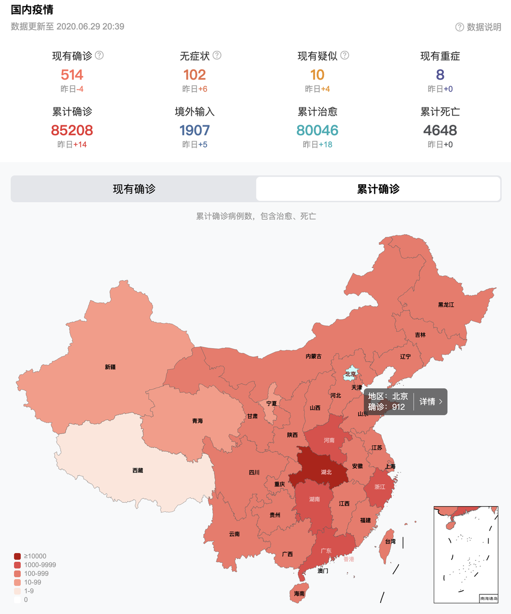

通过上述图表，大家可以很快掌握疫情发展态势如何？哪些地方疫情严重？正在好转还是正在恶化？

- 电商用户画像

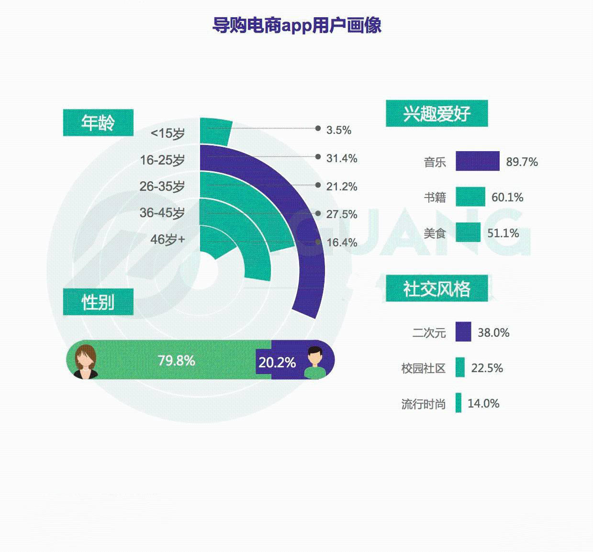

大家可能听说过电商杀熟。现阶段，分析用户构成，为不同类型用户差异化定价，是电商提高收益的重要手段。

- 金融风险评估     

​		大家可能都开过信用卡，会发现每个人能申请的信用卡额度都会有一些差异，特别用卡时间越久，额度差异越大。这就是银行利用用户的消费习惯设计还款风险模型，给容易选择分期还款的人增加额度，这样可以增加银行收益；但是也衡量用户还款能力，避免坏账。这就是金融风险数据分析。

那说了这么多，数据分析师到底在做什么呢？，总结起来有以下三个方面：

- 描述现状。
- 发现规律。
- 推动改进。

#### 1.3 数据分析主要流程

数据分析的主要流程可以总结为以下六个步骤：

1. 需求分析。

2. 数据收集。

3. 数据处理。

4. 数据分析。

5. 数据可视化。

6. 数据分析报告。

   

下面我们针对每个步骤详细介绍一下：

1. 需求分析

对需求进行分析和拆解是整个数据分析流程的首要环节，也是确保数据分析过程有效性的必要条件,可以为数据收集、处理、分析数据提供清晰的目标。

2. 数据收集

按照确定的数据分析框架，收集相关数据的过程，它为数据分析提供了素材和依据。这里所说的数据包括第一手数据与第二手数据，第一手数据主要指可直接获取的数据，第二手数据主要经过加工整理后得到的数据。

具体一点数据可以使我们业务数据，可以是我们的APP打点行为数据，也可以是第三方爬取数据，也可以是公开的市场数据。

我们后面的课程中涉及到的：Mysql数据查询，Hive的数据查询，爬虫 （Python) 都是数据收集的方式.

3. 数据处理

数据处理的基本目的是从大量的、杂乱无章、难以理解的数据中。抽取并推导对解决问题有价值、有意义的数据。

数据处理主要包括数据清洗、数据转化、数据提取、数据计算等处理方式，一般拿到手的数据都需要进行一定的处理才能用于后续的数据分析工作，即使再"干净"的原始数据也需要先进行一定的处理才能使用。

名词术语 ETL：EXTRACT(提取)、Transform(转换)、LOAD(加载);  这个就是指的数据处理。

4. 数据分析

数据分析是基于业务的问题，用适当的统计分析方法，分析模型对收集来的大量数据进行分析，将它们加以汇总和理解并消化，以求最大化地开发数据的功能，发挥数据的作用。

数据分析不仅仅需要对业务的深入理解（要有业务思维能力），也需要了解统计分析方法和分析模型（方法论），也需要借助各种工具，编程的使用。

5. 数据可视化

一般情况下，数据是通过表格和图形的方式来呈现的，我们常说用图表说话就是这个意思。常用的数据图表包括饼图、柱状图、条形图、散点图、雷达图等，当然可以对这些图表进一步整理加工，使之变为我们所需要的图形，例如金字塔图、矩阵图、漏斗图、帕雷托图等。

人们更愿意接受图形这种数据可视化方式，因为它更高效、直观地传递出分析师所要表达的观点。在一般情况下，能用图说明问题的就不用表格，能用表格说明问题的就不用文字。

我们后面的课程中涉及到可视化的工具：tableau， 神策数据平台，quick bi

6. 数据分析报告

一份好的数据分析报告，首先要有明确的结论，没有明确结论的分析称不上分析，同时也失去了报告的意义；

其次需要有一个好的分析框架，逻辑清晰，层次分明，能够让阅读者一目了然；

最后，在展示形式上应该图文并茂，可以令数据更加生动活泼，提高视觉冲击力，有助于阅读者更形象、直观地看清楚问题和结论，从而产生思考。

最后的最后：

数据分析师的核心目的是利用数据分析结论推动业务更好地发展；

所以，在产出报告之后，数据分析师还需要通过推动运营、产品、开发团队，将报告的建议进一步的变成实际的业务优化策略，或者是辅助策略制定。

**最后一个小节我们会带着大家一起做一个具体案例：某在线教育公司DAU近期出现异常波动，面对这个问题，作为数据分析师该如何进行分析呢？**

**要解决这类问题，我们需要掌握常用的数据分析方法论和业务分析模型**

### 第二节  数据分析方法论和分析模型

#### 2.1 数据分析方法论

做好数据分析是有方法的，大家要学会在平时的工作过程中，针对不同的业务场景套用合适的方法和模型去解决。

##### 2.1.1 明确问题方法论

比如我们接到一个问题：

某TOP游戏公司领导：“如何分析用户是否是小学生？”

那么你该如何去思考这个问题？

下面向大家介绍我们明确问题的其中一个常用方法：5W2H法。

梳理业务流程是一个挺复杂的过程，这个过程主要是以实际的业务场景为基础获取业务信息，然后抽象出一个以参与对象为节点的业务流程。用**5W2H**通过图等工具可以很方便的把业务梳理出来， 从而把问题明确。

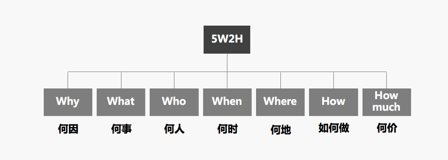

**回到我们问题本身：**

**“如何分析用户是否是小学生？”**

1.WHY —— 为什么会有这样的问题？为什么需要分析小学生而不是大学生或者小学生的父母？

2.WHO —— 这个产品的小学生和普通理解的小学生有没有差别？什么样的小学生才会使用这个产品？

3.WHERE —— 每个地方的小学生是不是都有一样的特点？什么地方的小学生特点比较突出？小学生的位置信息是否会有特点？

4.WHEN —— 小学生一般什么时候用这个产品？频率如何？和其他用户有什么差异？

5.WHAT —— 小学生有什么与其他用户不同的特点？

6.HOW —— 可能会有什么解决方案？

7.HOW MUCH —— 这些解决方案影响有多大？什么方案最好？

##### 2.1.2 拆解问题方法论

下面向大家介绍我们拆解问题的一种常用方法：逻辑树

首先，按照业务逻辑或者商业逻辑，把复杂问题拆解成若干个简单的子问题，像树枝一样逐步展开。

把已知的问题比作树干，然后考虑哪些问题或任务与已知问题有关，将这些问题或子任务比作逻辑树的树枝，一个大的树枝上还可以继续延伸出更小的树枝，逐步列出所有与已知问题相关联的问题。

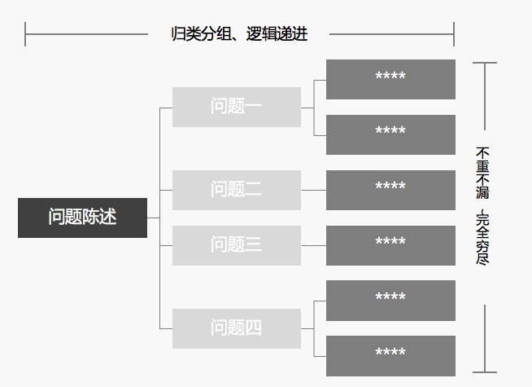

如何分析一家互联网知名的某贵金属电商平台网站利润？

结合商业知识，我们知道：净利润=总收入-总成本-总费用

按照业务结构：

总收入可以分为闭环收入、非闭环收入、广告收入及其他；

总成本可以分为闭环成本、主营业务成本、营销成本；

总费用可分为直接销售费用和分摊费用；

依次拆分各项目后即可将问题拆解为可分析的维度。

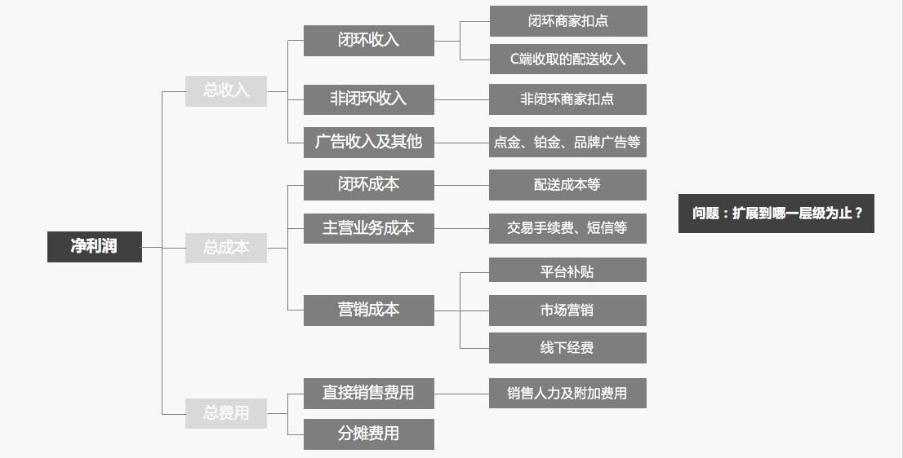

##### 2.1.3 定位问题原因方法论

当我们明确到某个具体指标出现问题后，通常我们需要定位问题的具体原因

比如，某APP产品近期在做产品功能迭代优化，某些新功能取代原有功能，产品转型没多久，APP总体用户量逐渐下跌，面对这个问题，我们该如何进行分析呢？

首先我们把问题明确为：APP产品功能调整导致用户下跌，然后进一步把下跌原因拆解成下图所示

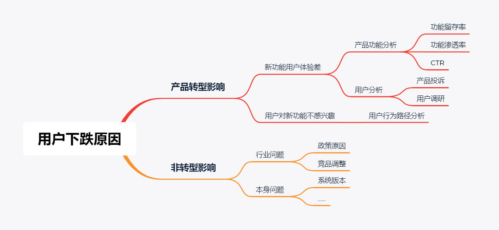

用户下跌的原因无非就两个。

**1. 转型影响**

- 新功能用户体验差

如果是新功能用户体验不好，那就需要做产品功能分析和用户分析。产品功能分析是包括产品功能留存率、功能渗透率和 CTR（点击通过率） 怎么样，找到异常点分析。用户分析则是对用户进行调研，或者对客户进行调研以及收集用户反馈意见等。

- 用户对新功能不感兴趣

如果用户是对新功能不感兴趣，那么我们就要重点对用户的行为路径进行分析，当用户使用该功能之后，是否立马就切换，如果切换时间太短说明用户压根就不感冒。

**2. 非转型影响**

- 行业问题

如果是行业问题，要看与行业相关的政策以及行业竞品是否有新的调整。

- 自身问题

如果是自身的问题，我们就要看系统版本等各方面数据。

基于这样一套思维导图，我们定位问题的逻辑就很清晰。

#### 2.2 数据分析模型

##### 2.2.1 如何进行用户分析

​		日常工作中，与用户相关的工作，如用户增长、社群、客服等，或许具体的工作内容和目标不相同，但都是围绕用户做事情。用户分析的价值体现在两个方面，一是在充分了解用户的前提下，有针对性的制定策略，避免盲目浪费；二是在有限的资源投入下，获得最大的ROI(Return on Investment,投资回报比 )效果，用户分析一般包含以下几个维度：

**1. 用户结构分析**

   	 在进行用户分析时，第一步就是要全面了解你的用户，包括性别，年龄，城市，职业等。同样是短视频平台，抖音和快手平台的用户也有一定差异。所以，在进行后续动作前，我们先要了解用户是谁，有什么特征。

 		比如日常做用户召回，如果我们是一个视频网站，主要用户以低龄儿童为主，那么我们推送《小猪佩奇》可能比推送《人民的名义》更合适；

​		如果我们是一个买菜app，用户以上班族为主，那么当我们做促销活动时，就需要更多考虑上班族的使用时间和购物偏好，选择上班族休息时间推送，推荐更多半成品，套餐类商品可能效果会更好；

  用户结构一般包含以下几个方面的信息：

- 自然属性：年龄，性别，地域，

- 社会属性：学历，家庭状况，婚姻，子女等；

- 商业属性：财富等级，消费档次，信用等；

- 心理属性：价格敏感性、偏好属性等；

- 行为属性：浏览频次，浏览品类、浏览价格带、下单频次、下单品类、下单价格带等；

- 价值属性：ADR贡献等。

对于用户结构中涉及的信息，可以分为静态和动态两大类，静态信息如性别，地域，家庭状况，婚姻等这些变化较小的信息，动态信息如产品的行为信息，在产品上贡献价值的信息等。后续如果要制定更加精准的策略，就要重点收集动态用户结构信息。

**2. 用户行为分析**

   在对使用产品的用户有了基本的了解后，我们需要把更多精力放在收集用户行为信息上。我们用一个在线OTA的app来举例。   

- A用户在到达产品后，在首页上下翻了翻就退出了app；

- B用户从首页进入了搜索模块，在输入位置信息后，浏览了位置周围的可订酒店信息后，返回了首页，然后通过精确搜索酒店名称，进入了酒店的详情页；

- C用户直接从首页底部的FEED推荐列表，进入了酒店详情页，并且在线提交了订单。

​    日常工作中，可以通过用户行为日志，将每一个用户的行为都标记出来，并且根据业务需要对行为进行标记。A用户就会被标记为无浏览行为用户，B用户就会被标记为有浏览行为但无交易用户，C用户就会被标记为有浏览行为且有交易用户。针对这些用户的标签，我们就能将用户进行分类，后续我们就可以针对每一类用户制定相应的策略。

- 对于A类用户，我们可以在其到达产品时，先设置一个新手上路指南，教授其基本的使用tips，主动的帮助用户体验产品。

- 对于B类用户，由于用户已经有了明确的偏好，我们完全可以将位置或酒店的信息打包，推送给用户，降低用户的搜索成本。

- 对于C类用户，可能此类用户属于被动接受型用户，比较依赖信息推荐这种策略。所以我们可以将FEED流推荐算法优化，并通过其他推送其他push信息流触达用户。

  对于用户的行为信息，我们要格外重视，因为行为往往能够体现用户的心理。一旦我们能够抓住用户的心理，那么便会大大提高我们后续策略的针对性和成功概率。

**3. 用户价值分析**

用户价值体现在两个方面，当平台是售卖物品或售卖服务的平台，用户发生的交易数据可以体现用户价值；如果平台是以广告变现的平台，那么用户的广告价值则体现用户价值。

我们用售卖物品或售卖服务的平台举例，用户在产品上发生的交易数据，一般与用户行为数据存储在不同的位置。所以，要想做用户价值分析，首先要打通用户行为数据和用户交易数据。这样用户在产品上发生的行为和结果就可以串联起来，避免出现用户数据被切割导致数据无法解读的情况。下面我们就集中精力来看一下，分析用户交易数据的价值。

  举例：

​    比如一款知识分享类的app上线一段时间后，推出了各种付费套餐，比如月卡、季卡、年卡、专门某个大V的分享文章等。根据用户是否购买，很自然的就可以将用户分为普通用户和付费用户。

​    对于付费用户，如果没有进行更加精细的分层，由于我们提供的服务没有差异化，可能会导致用户体验降低，从而损失一部分付费用户和价值。比如，一个用户买了月卡，一个用户买了年卡。这两个用户购买的产品，以及对应的价值是不同的。 

​    假设我们对这两个用户，在可看的文章范围上一样，都可以给作者私信并保证获得回复，都能收到产品内部的推荐通知等等，请大家想一下，对产品和商业价值会有什么影响？会不会年卡用户发现与月卡用户权益一样后，转而购买月卡？那这样的话，原本一个生命周期为1年 的用户，一下子变成了 1个月，那么产品的用户规模，公司的短期收益，长期变现可能等方面都会受到直接的影响。

​    针对不同价值的用户进行分析，一般考虑如下方面：

- 购买金额：指在一段时间内累计的消费金额；

- 购买频次：指在一段时间内，购买的次数；

- 购买平均金额：指在一段时间内，平均每次消费的金额；

- 购买内容：指在一段时间内，购买商品或服务的属性；

- 复购频次：指在一段时间内，反复消费的次数；

- 复购间隔：指在一段时间内，每次复购行为之间的时间间隔；

- 复购内容：指在一段时间内，每次复购时购买的商品或服务的属性。

这里分享一些经验：

- 用户的交易数据经常会被忽略，一是由于底层数据是分开存储的，导致获取和串联有些难度；二是商业和产品是两个团队，也会存在一定的沟通成本。

  

- 用户的交易数据要和用户的行为数据结合起来，这里有个心理学公式：行为+结果=心理。

  比如有两个用户在电商交易平台上反复查找和对比某个商品，最终一个下单，另一个没有下单。

  单从行为数据上看，两个用户都是潜在购买用户，那么是否可以考虑持续的为其推荐相关产品呢；

  而从交易数据上来看，一个用户购买，另一个用户没有购买，那么是否可以将没有购买的用户定义为非潜在用户呢；

  如果将行为数据和交易数据结合起来看呢，我们会将两个用户都定义为潜在购买用，对于下单购买的用户，可以为其推荐相关的周边产品来增加价值贡献，而没有下单的用户，可以分析其没有购买的原因，同时持续的为其推荐该商品，努力促成下单转化。

- 不要单纯的把用户交易数据当作结果数据使用。比如，一个用户在第一次发生交易后，每隔一段时间就会继续发生交易，那么该用户就不能被简单的定义为普通用户，而应视为忠实用户。

##### 2.2.2 用户生命周期模型

​    用户生命周期，源自于传统营销学里面的客户生命周期一说，特别是在政治、经济、环境、社会等诸多领域经常出现，其基本涵义可以通俗地理解为“从摇篮到坟墓”（Cradle-to-Grave）的整个过程，在互联网行业中，用户的生命周期指的是：**用户接触你的产品到最后流失的整个过程。**

​    一般互联网生命周期包括：**引入期**、**成长期**、**成熟期**、**休眠期**和**流失期**5个周期。

​	1.引入期：指用户从下载到进入我们产品的时期。

​	2.成长期：一般用户成功使用产品或多次购买产品之后，便进入了成长期。

​	3.成熟期：指用户通过多次购买，成为了忠实用户，产品占领用户心智。

​	4.休眠期：用户在一定时间内，没有再次购买过平台产品。

​	5.流失期：用户超出设定的休眠期时间，没有购买过产品。

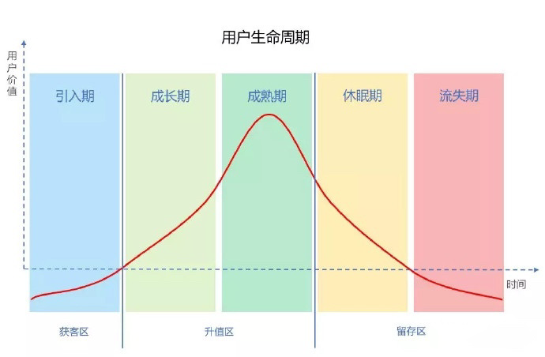

**1. 用户生命周期模型作用**

​    随着移动互联网的用户增长趋近饱和，获客成本越来越高，留住一个老用户的成本远比获取一个新用户的成本低，这使用户的留存就显得至关重要。而按照用户生命周期来划分用户，能够帮助我们了解不同生命周期的用户需求，开展运营策略，从而减少用户流失。

​    针对不同阶段的用户，采取针对性运营策略，从而**延长用户的生命周期**，**尽可能让用户产生商业价值**。在运营愈发精细化的当下，通过搭建用户生命周期体系，让运营工作更加精细化、效率化、产品化，对于提高平台运营的效果和效率至关重要。

​    在用户生命周期中有两个阶段要注意：

-  要缩短成长期：主要是因为平台渠道投放，损耗了大多数利润，如果不能尽快转化为成熟用户，很容易导致流失，平台就会持续亏损。

-  延长成熟期：用户在成熟期前，平台需要通过补贴引导用户成长，获取的利润极低，只有成为成熟用户，才能将利润最大化，而用户成熟期周期越长，利润越大。

**2. 用户生命周期运营策略**

​    不同的平台根据自己的业务类型，都有自己的一套运营体系。那用户生命周期理论是如何服务于业务的呢？

​    首先，结合公司业务特点，一般将用户分为五类：**新客，首次成交用户，忠实用户，潜在流失用户，流失用户**。这五类用户与用户生命周期五阶段大致一一对应，根据业务演变出最需要关注，且可执行的用户分类，从而实现高效运营。

- ###### 引入期 -- 新客

​    新客，即注册的新用户；运营的目标就是促成其完成首次成交。

另外还要注意的是，

​	1.平台获客的手段大同小异，线下广告有地推，线上广告有信息流，SEM，应用商店等五花八门，除了渠道投放和品牌营销，平台也会推出营销活动来获客，比如MGM，也就是老带新，对于获客成本高的平台，如果能将MGM做好，对于整个拉新有奇效，而且，通过MGM注册的新用户，是非常优质的，尤其是业务对用户信任度依赖性很强的平台。

​	2.产品一定要下功夫打磨，做好用户留存。比如新手引导、激励体系，操作难易程度，学习成本等方面都要做好，操作太过复杂会导致用户严重流失。

- ###### 成长期 -- 首次成交用户

​    完成首次成交的用户，即视为成长期用户，一个完成首次成交的用户相比于一个没有成交的用户，留存率肯定是前者更高，这个阶段的运营策略就是提高用户的更多成交。

​    为了达到这个目的，可以投入产品层面新客户专享的福利，如红包引导更多成交。

- ###### 成熟期 -- 忠实用户

​    用户通过多次购买，成为了忠实用户，产品占领用户心智。要知道用户从陌生-熟悉-信任，需要一个很长的过程。一旦用户开始信任平台后，他的转移成本是很高的，因为他还要花时间去熟悉别的平台。在这个时期内，客户愿意支付较高的价格，带给企业的利润较大，而且由于客户忠诚度的增加，企业将获得良好的间接收益。

​    此时运营策略就是要让这部分用户持续购买。可以通过持续不断的安全方面的包装，大力度的营销活动和有趣的小游戏，如积分商城+每日签到+免费抽奖、会员成长体系+好友邀请福利等。

- ###### 休眠期 -- 潜在流失用户

​    当用户存在流失倾向时，尽量在他流失前留住他，否则，后面等待的将是更高的召回成本。潜在流失的召回，必须了解用户的需求，找到根源。比如通过回访，外呼，用户行为分析，问卷调查等方式，了解原因，对症下药。如果无法挽回，就要避免更多的用户因为同样的问题流失，亡羊补牢未为晚也。

​    这个阶段的运营策略就是促活，即平时要建立VIP专线及专人服务措施、加强舆情监控、及时发现异动。

- ###### 流失期 -- 流失用户

​    用户流失是很容易被运营人员忽视的一个环节，而且也不能短时间内出效果，需要平时多研究，多尝试，多复盘。不仅要进行日常监测，还要对其采取运营措施，比如活动召回、push、短信、外呼等，不断复盘优化，形成体系。在重大营销时，可以尝试加大召回力度，效果好的也许会出乎意料。

- ###### 小结：

​    通过以上内容们可以看到，很多运营策略牵扯到市场部的渠道优化、品牌部的舆情监控和形象包装、客服部的用户回访和VIP维护、产品部的功能优化，只有将公司各部门的资源和工作整合在一起，才能发挥最大效应。

##### **2.2.3 AARRR用户增长模型**

**1. AARRR模型概念及作用**

​    **AARRR**是获取（Acquisition）、激活 （Activation）、留存（Retention）、收入（Revenue）和推荐（Referral），这个五个单词的缩写，分别对应用户生命周期中的5个重要环节：**获取用户、激活用户、用户留存、变现、产品推荐**。

​    **AARRR**模型因其掠夺式的增长方式也被称为海盗模型，同时它也是一个典型的漏斗模型，可以用来评估连续的业务流程节点转化率。通过该模型可以有针对性的对出现问题的重要节点进行优化，达到提升ROI的目的。

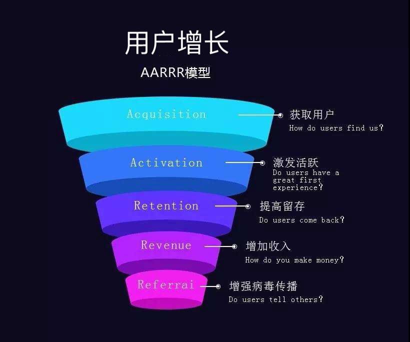

**2. AARRR模型各环节说明**

如果我们把产品看做一个蓄水池的话，这5个环节可以画成下面这样：

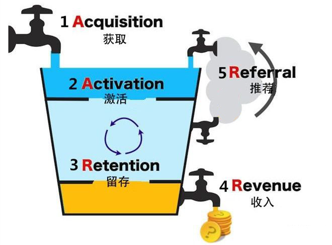

​    在这个漏斗过程中,用户可能会一步一步慢慢流失,剩下的部分用户实现最终转化，现详细介绍一下每个环节。

3. **获取用户(Acquisition) -- 用户如何找到我们**

​    在营销推广中，什么渠道带来的流量最高，渠道的ROI如何？不同广告内容的转化率如何？都是在获取用户这一步进行分析的。所以，在投放资源有限的前提下，如何才能获得最好的投放效果，这就要求我们对潜在用户有基本的了解，并且能够对这些用户分类，就可以将资源集中在最有可能获得效果的地方，获得最大的ROI效果。

​    产品投放在什么渠道才能直达用户的视线范围，一般渠道分为三种：一是口碑渠道，适合病毒营销；二是有机渠道，适合搜索引擎优化、内容营销；三是付费渠道，比如电视广告、赞助。

另外，获取用户需要重点关注的指标：

- 渠道曝光量：有多少人看到产品推广的线索

   渠道转换率：有多少用户因为曝光转化成用户

​	3.日新增用户数：每天新增用户数

​	4.日应用下载量：每天有多少用户下载该应用

​	5.获客成本(CAC):获取一个用户所消耗的成本

-  ......

4. 激活用户(Activation) -- 用户的首次体验如何

​    如果每天有大量用户来使用你的产品，但没有用户和你建立强联系，你就无法进行后续的运营行为。所以通过合理的手段和方式，让用户从沉默变活跃，从低频到高频等。如何将新增用户转化为活跃用户，是运营者面临的第一个问题。首先我们要理解下什么是活跃？  

​                 **DAU = 当日新增 + 累计历史日留存**

​    即今日活跃的用户中，一部分是新增，另外绝大部分都是以往的留存用户，产品运营周期越长，新用户占比越少。所以分析活跃可以从两个角度出发：1.活跃用户构成 2.产品粘度。

​	1.**活跃用户构成**：新用户数、老用户数、新老用户占比、新老用户活跃率、忠诚用户数、回流用户数、流失用户数、1次/1日登录用户占比等指标，根据不同产品运营时期，有不同的参考数值。

​	2.**产品粘度**：产品黏度很关键的指标，它说明了用户对产品的喜欢接纳程度，我们通常用**MAU/DAU** 来定义产品的黏度指标，比值代表用户回访的天数（几天会用一次产品），当MAU/DAU=1的话说明这款产品用户每天都用；**DAU/MAU \* 30** 代表用户一个月会用几次产品。

​    

激活用户需要关注的其他指标

​	1.日活跃用户数（简称日活）：一天之内，登录或使用某个产品的用户数。类似的还有周活跃用户数，月活跃用户数

​	2.活跃率（活跃用户占比）：某一时间段内活跃用户在总用户的占比。根据时间可分为日活跃率（DAU）、周活跃率（WAU）、月活跃率（MAU）等

​	3.用户流失率：用户流失率和留存率恰好相反，如果某产品新用户的次日留存为20%，那么反过来说明有80%的用户流失了

​	4.PV(PageView)是页面浏览量，用户每打开一个网页可以看作一个PV，用户看了十个网页PV为十。

​	5.UV（Unique Visitor,独立访客数）是一定时间内访问网页的人数，不管用户访问多少网页，他都只算一个独立访客，怎么确认用户是不是同一个人呢？技术上通过网页缓存cookie或者IP判断，如果这两者改变了，则用户算作全新的访客。

5. 用户留存(Retention) -- 用户会回来吗

​    用户在使用产品一段时间后，逐渐降低使用频次，甚至出现一定时间没有使用的情况，此时要想办法增加用户的使用频次，或者与用户保持产品交互。这个阶段和促活比较相似，核心都是让用户活跃起来，持续的使用产品或保持互动。

​    而通常维护一个老用户的成本要远远低于获取一个新用户的成本，分析出用户在哪里流失，为什么流失，才能有的放矢的解决问题。做好了留存，才能保障新用户在注册后不会白白流失，达到用户规模的持续增长。

用户留存关注的指标有：

- **次日留存率**：（当天新增的用户中，在第二天使用过产品的用户数）/第一天新增的总用户数

- **第3日留存率**：(第一天新增的用户中，在第3天使用过产品的用户数)/第一天新增的总用户数

- **第7留存率：**（第一天新增的用户中，在第7天使用过产品的用户数）/第一天新增的总用户数

- **第30天留存率：**（第一天新增的用户中，在第30天使用过产品的用户数）/第一天新增的总用户数

​    

 提升活跃与留存4种方式：

​	1. **有效触达，唤醒用户**：指的是通过手机PUSH、短信和微信公众号等能够触达到用户，唤醒沉睡用户启动APP的方式，是提升留存的非常有效的方法之一。如游戏老用户短信召回，电商老用户召回，召回肯定是有成本的，所以要根据用户以往行为，进行分析定位，找到召回率最高的那部分用户。

​	2. **搭建激励体系，留存用户**：好的激励体系，可以让平台健康持续发展，让用户对平台产生粘性，对提升留存非常有效。通常使用的激励方式有成长值会员体系、签到体系、积分任务体系等。

​	3. **丰富内容，增加用户在线时长**：这点游戏产品做的非常好，各种玩法活动本身就吸引用户投入时间成本，游戏又不断强化社交属性，更增加用户粘度与成本投入。

​	4. **数据反推，找到关键点**：比如知乎，评论超过3次，用户就会留存下来，很难流失。比如有些游戏产品，一旦玩家跨过某个等级就很难流失。这些都是你需要通过数据分析才能找到的关键点。

6. 变现(Revenue) -- 如何赚到钱

​    当产品提供的价值可以满足用户需求时，就可以考虑变现的问题了。 如何从用户身上获得真正的收益，比如让用户续订、创造更多的广告位等，根据不同的业务模式，变现的方式也不同：媒体类平台依靠广告变现，游戏类依靠用户付费，电商类通过收取佣金或卖家付费的方式等。

变现，即增加收入需要关注的指标：

**客单价：**每位用户平均购买商品的金额，客单价=销售总额/顾客总数。

**PUR：**（pay user rate） 付费用户占比。

**复购率：**一定时间内，消费两次以上的用户/总购买用户数，如果10个客户购买了商品，5个用户产生了重复购买，则复购率为50%。

还有ARPU、ARPPU、付费率（区分新老）、回购率等。

7. 产品推荐(Refer) -- 用户会告诉其他人吗

​    在产品和用户之间的关系逐渐稳定后，自然会有一部分用户进行推荐。产品推荐，也叫病毒式传播，是每个产品向往的推广方式，除了好的营销方式铺垫，更重要的还是要靠产品自身的品质。通过模型前四个阶段的优化分析，从不稳定用户、活跃用户再到最终的忠实用户，将获客做最大的留存和转化，培养为企业的忠实用户，通过社交口碑传播可以给企业带来高效的收益。

比如

健身APP，鼓励用户将运动轨迹分享到微信朋友圈来打卡，从而实现用户的自主传播；

美团APP，通过红包这样的超级营销工具，实现产品的自传播

这一环节需要关注的指标：

**转发率**：转发的用户数/看到该功能的用户数。

**转化率**：比如淘宝转化率=某段时间产生购买行为的用户数/所有到达店铺的访客人数，比如双十一，看到店铺某个产品的客户有100个，最后下单的人数有10个，则转化率为10%。

**K因子**：用来衡量推荐的效果。K因子=（每个用户向他的朋友发出请求的数量）*接收到邀请的人转化为新用户的转化率。K>1 用户像滚雪球一样的增大；K<1 用户群到某个规模时就会停止通过自传播的增长。

8. 小结

​    通过AARRR模型，我们看到产品运营每个环节都至关重要，获取用户关系到我们的产品多大程度进入市场，活跃与留存关系到产品生命周期，收入的重要自是不必多说，自传播则是我们尽可能争取的资源，降低成本扩大影响的环节，每个环节都需要大量的数据分析和迭代，从而不断改进产品。

##### 2.2.4 RFM模型

1. **RFM模型概念及原理**

​    RFM模型是衡量当前用户价值和客户潜在价值的重要工具和手段。RFM是3个指标的缩写，最近一次消费时间间隔（Recency），消费频率（Frequency），消费金额（Monetary）。

- **R**值：Rencency（最近一次消费）

  指的是用户在店铺消费最近一次和上一次的时间间隔，能够判断用户的活跃程度，上一次消费离得越近，R的值越小，用户活跃度越高，用户价值也就越大，即对店铺的回购几率最有可能产生回应。

- **F**值：Frequency（消费频率）

  指的是是用户在固定时间内的购买次数，能够判断用户的忠诚程度，购买频率越高，也就是F的值越大，用户价值越高。

- **M**值：Monetary（消费金额）

  指的是一段时间（通常是1年）内的消费金额，能够判断用户对于平台的贡献价值，即重要程度。消费金额越高，也就是M的值越大，用户价值越高。

  所以，我们可以先通过M值（消费金额）将用户分成两部分，一部分是贡献金额较多的用户，另一部分是贡献金额相对较少的用户。在此基础上，通过F值（消费频率）将用户分成忠诚与不忠诚，得到四个层级的用户。最后，再用R值（最近一次消费）将用户分成活跃与不活跃，得到最终的8个层级的用户：重要价值用户、重要召回用户、重要发展用户、重要挽留用户、一般价值用户、一般召回用户、一般发展用户、一般挽留用户。分层如下：

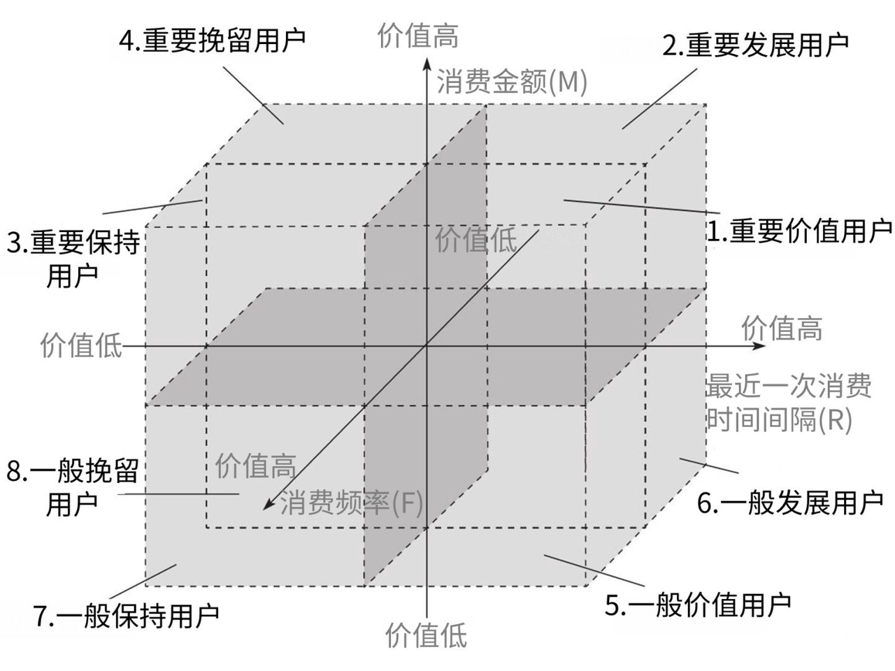

​    

  RFM这3个值对应的价值是高还是低，对应到下面这张表里就得到了用户分类的规则。

| 用户分类规则   |                   |               |               |
| -------------- | ----------------- | ------------- | ------------- |
| 用户分类       | R值(最近一次消费) | F值(消费频率) | M值(消费金额) |
| 1.重要价值用户 | 高                | 高            | 高            |
| 2.重要发展用户 | 高                | 低            | 高            |
| 3.重要保持用户 | 低                | 高            | 高            |
| 4.重要挽留用户 | 低                | 低            | 高            |
| 5.一般价值用户 | 高                | 高            | 低            |
| 6.一般发展用户 | 高                | 低            | 低            |
| 7.一般保持用户 | 低                | 高            | 低            |
| 8.一般挽留用户 | 低                | 低            | 低            |

​    这样就可以对不同价值用户使用不同的营销决策，把公司有限的资源发挥最大的效果，这就是我们常常听到的精细化运营。比如第1类是重要价值用户，这类用户最近一次消费较近，消费频率也高，消费金额也高，要提供vip服务。

​    总结一句话就是，只有将用户进行了合理的分类，并制定更有针对性的策略，才能在资源有限的情况下，得到最好的ROI效果。

2. 如何使用RFM模型进行用户价值分类

- ###### 确定RFM三个指标的分段和每个分段的分值

R值：最近一次消费越近，得分越高，最高5分，最低1分

F值：消费频率越高，得分越高，最高5分，最低1分

M值：消费金额越高，得分越高，最高5分，最低1分

这里简单设定一下区间，实际工作中要以具体业务指标为准（最近1个月用户消费信息）

| 指标              | 分值       |             |             |             |            |
| ----------------- | ---------- | ----------- | ----------- | ----------- | ---------- |
|                   | 5          | 4           | 3           | 2           | 1          |
| R值(最近一次消费) | 3天以内    | 3-5天       | 5-10天      | 10-20天     | 20天以上   |
| F值(消费频率)     | 20次以上   | 10-20次     | 6-8次       | 2-6次       | 2次以下    |
| M值(消费金额)     | 5000元以上 | 3000-5000元 | 1500-3000元 | 1000-1500元 | 1000元以内 |

- ###### 计算每个客户RFM三个指标的得分

如：    

| 用户ID | R值(最近一次消费) | F值(消费频率) | M值(消费金额) | R值得分 | F值得分 | M值得分 |
| ------ | ----------------- | ------------- | ------------- | ------- | ------- | ------- |
| 1      | 2天               | 5次           | 2000元        | 5       | 2       | 3       |
| 2      | 4天               | 7次           | 4000元        | 4       | 3       | 4       |

- ###### 分别计算出R值、F值、M值的平均值

如：

| 用户ID | R值(最近一次消费) | F值(消费频率) | M值(消费金额) | R值得分 | F值得分 | M值得分 |
| ------ | ----------------- | ------------- | ------------- | ------- | ------- | ------- |
| 1      | 2天               | 5次           | 2000元        | 5       | 2       | 3       |
| 2      | 4天               | 7次           | 4000元        | 4       | 3       | 4       |
|        |                   |               | 平均分        | 4.5     | 2.5     | 3.5     |

- ###### 用户分类

​    在每一行记录后面，记录R、F、M3个值是高于平均值，还是低于平均值。如果一行里的R值得分大于平均值，就在R值高低列里记录为“高”，否则记录为“低”，同理，F值、M值也这样比较。

| 用户ID | R值得分 | F值得分 | M值得分 | R值高低 | F值高低 | M值高低 |
| ------ | ------- | ------- | ------- | ------- | ------- | ------- |
| 1      | 5       | 2       | 3       | 高      | 低      | 低      |
| 2      | 4       | 3       | 4       | 低      | 低      | 高      |

然后和用户分类表格里定义的规则进行比较，就可以得出用户属于哪种类别。

| 用户ID | R值得分 | F值得分 | M值得分 | R值高低 | F值高低 | M值高低 | 用户分类     |
| ------ | ------- | ------- | ------- | ------- | ------- | ------- | ------------ |
| 1      | 5       | 2       | 3       | 高      | 低      | 低      | 一般发展用户 |
| 2      | 4       | 3       | 4       | 低      | 低      | 高      | 重要挽留用户 |

- ###### 精细化运营

​    对用户进行分类后，如何精细化运营呢？这个具体公司业务不同，方法也不一样。这里简要举例说明前4类用户。

​	1. 重要价值用户，RFM三个值都很高，要提供vip服务。

​	2. 重要发展用户，消费频率低，但是其他两个值很高，就要想办法提高他的消费频率。

​	3. 重要保持用户，最近消费距离现在时间较远，也就是F值低，但是消费频次和消费金额高。这种用户，是一段时间没来的忠实客户，应该主动和他保持联系，提高复购率。

​	4. 重要挽留客户，最近消费时间距离现在较远、消费频率低，但消费金额高。这种用户，即将流失，要主动联系用户，调查清楚哪里出了问题，并想办法挽回。

| 用户分类       | R值(最近一次消费) | F值(消费频率) | M值(消费金额) | 精细化运营           |
| -------------- | ----------------- | ------------- | ------------- | -------------------- |
| 1.重要价值客户 | 高                | 高            | 高            | VIP服务              |
| 2.重要发展客户 | 高                | 低            | 高            | 提高消费频率         |
| 3.重要保持客户 | 低                | 高            | 高            | 主动联系，提高复购率 |
| 4.重要挽留客户 | 低                | 低            | 高            | 分析原因并挽回       |
| 5.一般价值客户 | 高                | 高            | 低            |                      |
| 6.一般发展客户 | 高                | 低            | 低            |                      |
| 7.一般保持客户 | 低                | 高            | 低            |                      |
| 8.一般挽留客户 | 低                | 低            | 低            |                      |

- ######  小结

1. R、F、M指标定义，不同业务定义不同。要根据具体业务灵活应用。

1. R、F、M按价值如确定打分规则，一般分为1-5分，也可以根据具体业务灵活来调整。或者使用聚类的方法对R、F、M的值进行分类，然后给每个类别打分。

这样通过RFM模型来分析用户，对用户进行精细化运营，不断将用户转化为重要价值用户。

#### 2.3 数据分析方法

| 数据分析作用 | 基本方法 | 数据分析方法 |
| ------------ | -------- | ------------ |
| 现状分析     | 对比     | 对比分析     |
| 原因分析     | 细分     | 分组分析     |
| 漏斗图分析   |          | 漏斗图分析   |
| 矩阵关联分析 |          | 矩阵关联分析 |
| 预测分析     | 预测     | 回归分析     |
| 时间序列     |          | 时间序列     |
| 决策树       |          | 决策树       |

##### **2.3.1 对比分析**

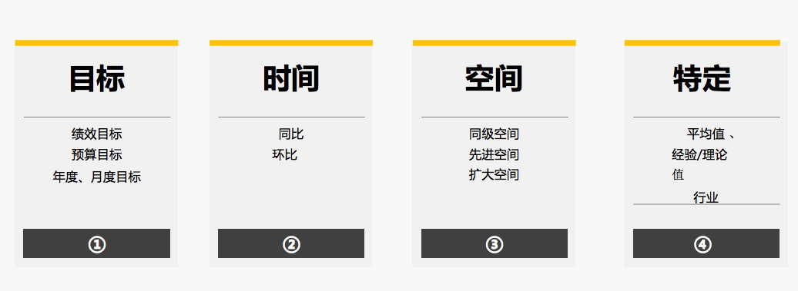

1. 一个数值，摆出来孤零零的，肯定很难理解，通过与目标的对比，与时间的对比，与空间的对比，与特定值的对比，在差异中找到问题，或者找到变化。

1. 要求

- 所选择的对比对象具备可比性，越相似的对象越具备可比性。

- 对比的指标定义、范围、计算方法是一致的。

- **举例**：   

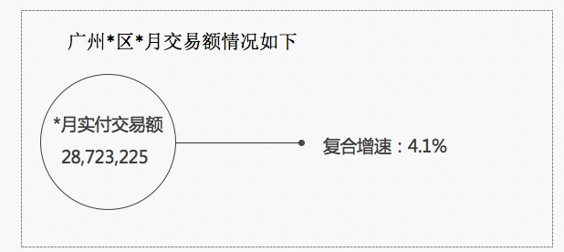

-   数据分析如下：

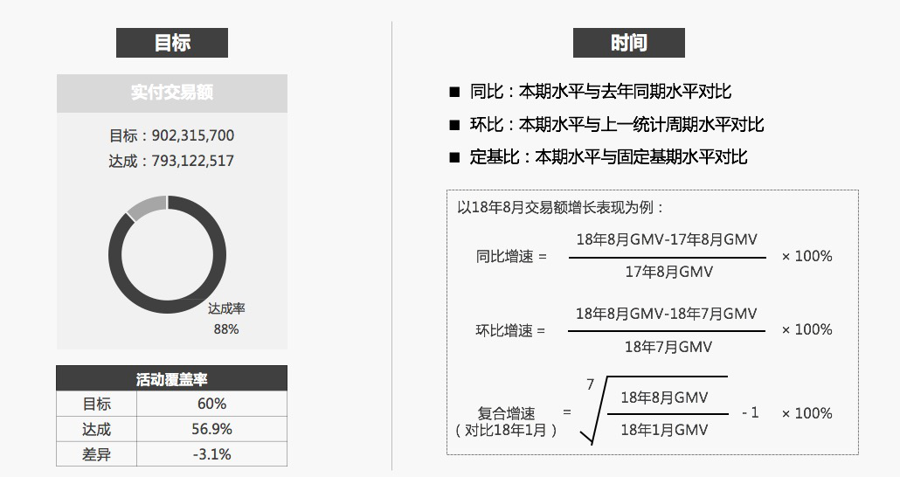

- 按照空间对比可以进行同级团队所属区域，上级区域，大盘进行对比，与特定范围对比，历史经验值、行业竞对数据等进行分析。

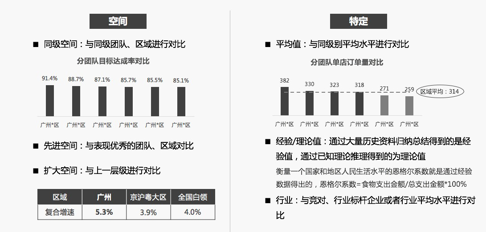

- 结论如下：

  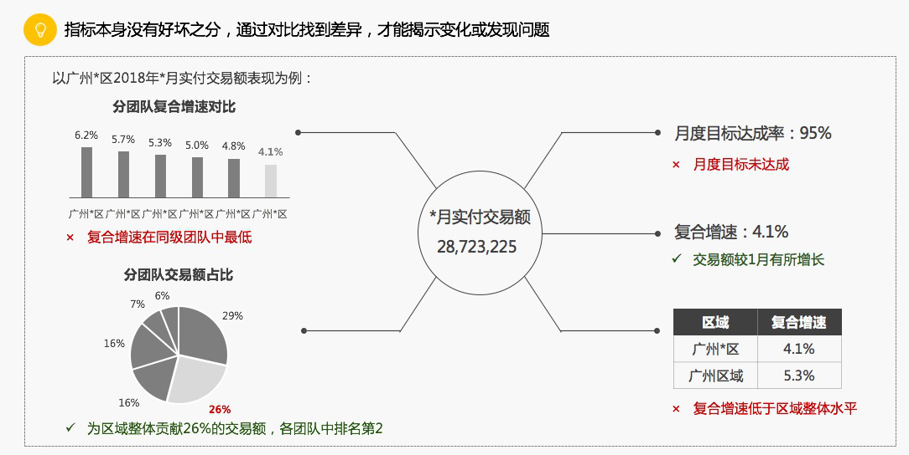

##### **2.3.2 趋势分析法**

- 根据企业连续几年或几个时期的分析资料，运用指数或完成率的计算，确定分析期各有关项目的变动情况和趋势的一种财务分析方法。

- **趋势分析法的一般步骤是：**

  1. **计算趋势比率或指数**

  2. **根据指数计算结果，评价和判断企业各项指标的变动趋势及其合理性**

  3. **预测未来的发展趋势**

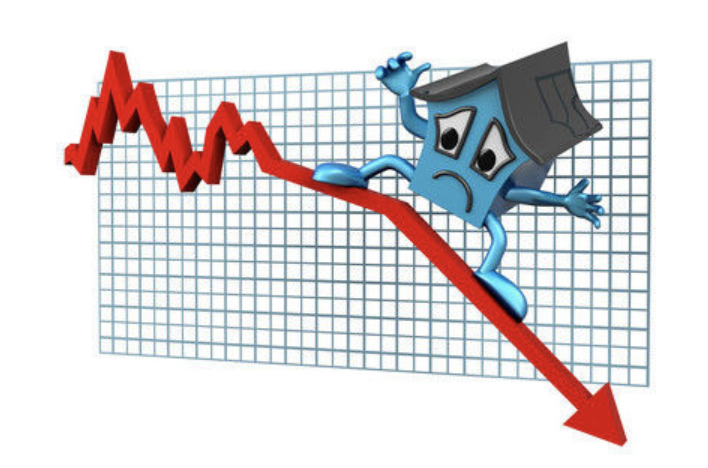

##### 2.3.3 矩阵关联分析法

- 根据事务的两个关键属性作为分析依据，进行分类关联分析，找到解决问题的方法。

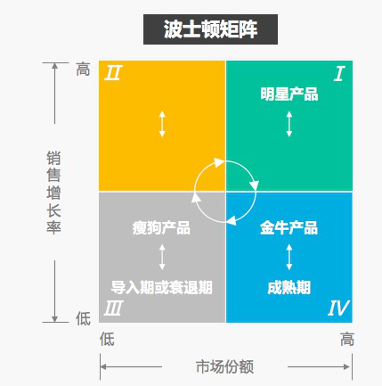

- 举例：

- 根据增速和交易规模，我们应该看重第一优先关注规模大，增速快，保证这些地区的稳定增长，以及规模量级不足，但是以及体现出快速增速的区域，可能未来会成为规模大的区域。

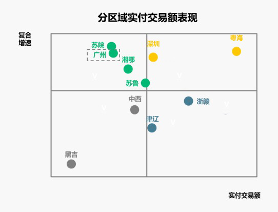

##### **2.3.4 分组分析**

根据数据分析对象的特征，按照一定的标志（指标），把数据分析对象划分为不同的部分和类型来进行研究，以揭示其内在的联系和规律性。

**举例：**

| 统计指标 | 年龄、性别、地域           |
| -------- | -------------------------- |
| 付费状态 | 免费、使用、付费           |
| 购买历史 | 未付费、一次付费、多次付费 |
| 访问位置 | 使用产品的区域位置         |
| 使用频道 | 使用产品的频道             |
| 使用深度 | 轻度、中度、重度           |
| 广告点击 | 点击广告、未点击广告       |

##### **2.3.5 漏斗分析**

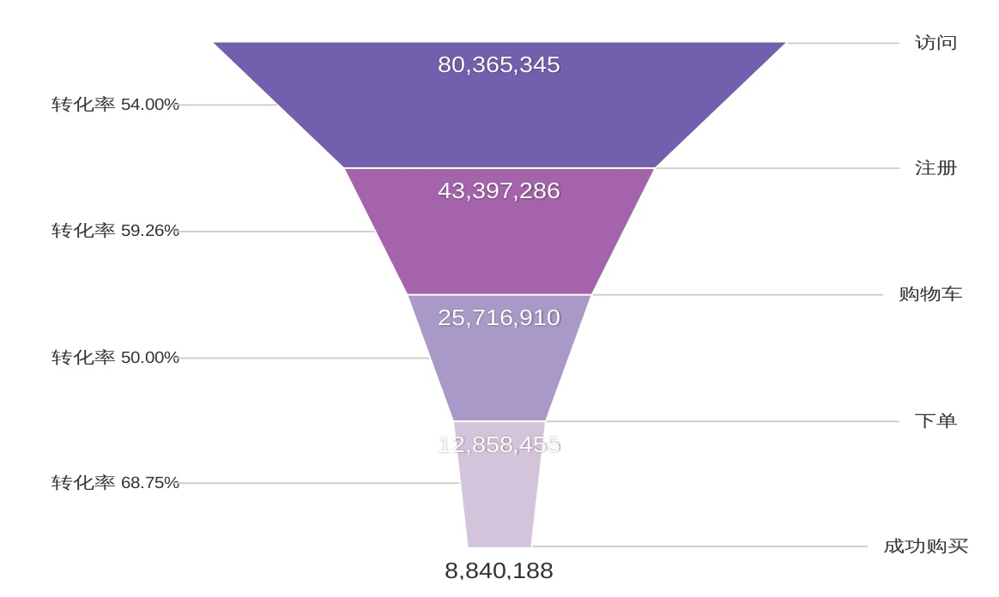

​        适合业务流程比较规范、周期比较长、各流程环节涉及复杂业务流程过程比较多的管理工具。因为漏斗图是对业务流程最直观的一种表现形式，并且最能说明问题的所在，通过漏斗图可以很快发现业务流程中存在问题的环节。

​        它能告诉用户在业务中懂得转换率和流失率，在业务网站中的受欢迎程度或重要程度。通过对不同业务的漏斗图进行对比，可以找出何种业务在网站中更受用户的欢迎或更吸引用户。

##### 2.3.6 细分分析

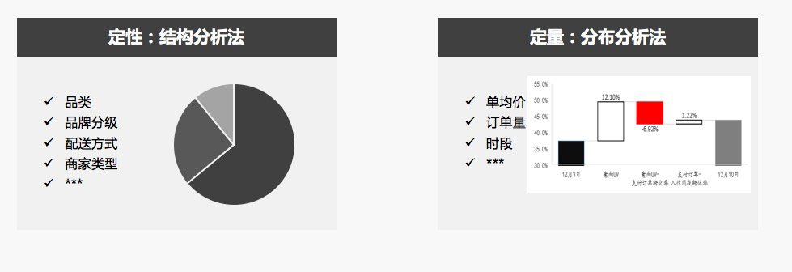

- 在经营分析中，对单一指标的判定是远远不够的，需要通过细分来了解影响指标的真正因素是什么。才能最终达成解决问题这个目标。

- 拆组成：根据分析对象的特征，按照一定的标准拆分，讲性质相同的对象合并在一起，保持组内对象的一致性，组与组之间属性的差异性。

- 拆步骤：针对业务流程判断的一种分析方法，通过对某些关键指标路径转化率的分析，发现业务流程中存在的问题。

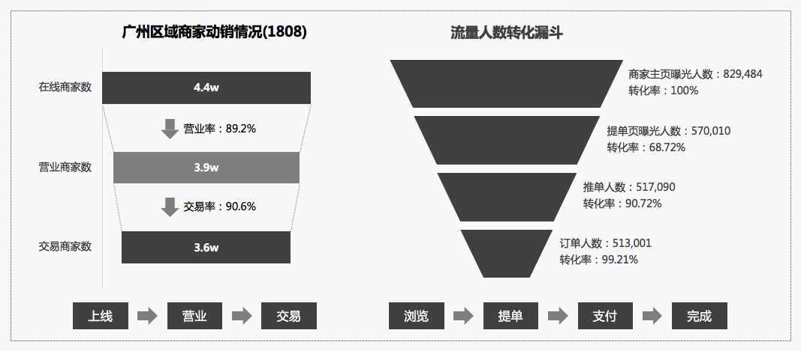

- 拆要素：针对指标的构成要素向下分拆，拆到最末级要素时，就可以定位到末级指标对应的影响因素。从而能够做到指导具体的业务动作。

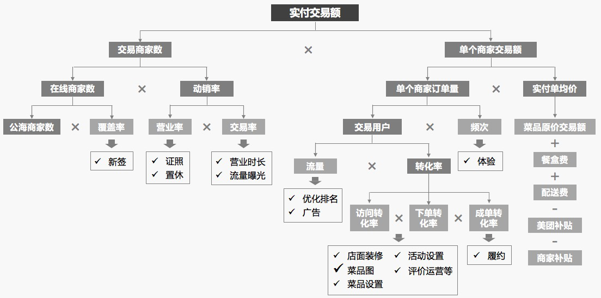

- **杜邦分析法**

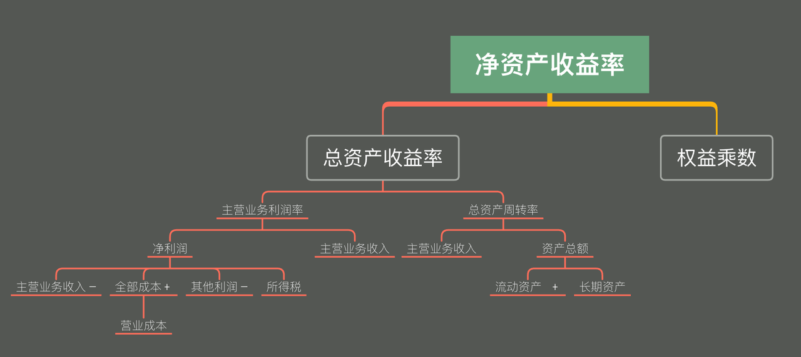

- 由美国杜邦公司创造并最先采用的一种综合分析方法，又称杜邦财务分析体系，简称杜邦体系，利用各主要财务指标间的内在联系，对企业财务状况及经济效益进行分析评价的方法。该体系以净资产率为龙头，以总资产收益率和权益乘数为核心，重点揭示企业盈利能力及权益乘数对净资产的影响，以及各相关指标间的互相影响，为各级管理层优化经营理财状况、提高公司经营提供了思路。

### 第三节  数据分析业务指标

业务指标的定义：

​		对业务有参考价值的的统计数据。

业务指标的作用：

​         当企业确定发展目标时，就需要使用业务指标来量化发展目标；

​         同时，通过拆解核心业务指标到细致的数据指标，精细化的进行企业经营。

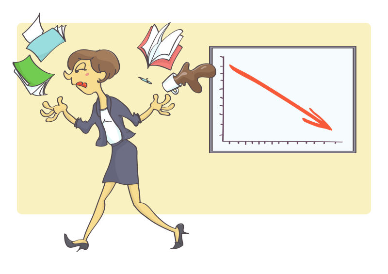

#### 3.1 产品运营指标

比如分析运营层面的指标，我们需要从用户获取、活跃、留存、传播整个周期分析用户具体指标。（如果产品是平台类的产品，有用户，平台，作者（生产者，商家，服务供应者）组成，那么一般运营会涉及用户运营、作者运营，以下仅展开用户运营，作者运营与用户运营关注指标类似。）

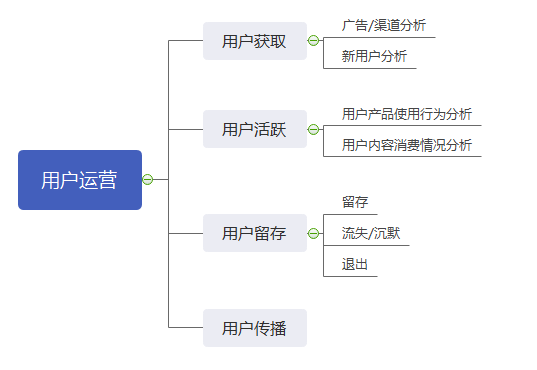

比如当我们接触运营团队，我们需要从整体了解现有产品运营状况。

大家应该记得小学里一边注水一边放水的数学题目，而产品就是咱的水池，用户就是水，用户获取就是注水环节，用户流失就是放水环节；而运营的目标，就是增加用户进入，减少用户流失，并让用户在产品里待的时间更久，或者说让用户在产品里产生更多的价值。

另外一点就是，如何选择北极星指标的问题：

我们会根据我们产品的生命周期选择不同的指标作为北极星指标。比如成长期，我们的目标应该更多以用户增长为主；产品成熟期，我们的目标应该更多以用户活跃为主；

那么如何选择北极星指标呢？以用户成长期为例：一般很容易想到的就是新用户数量，但是一般新用户存在几个问题，用户可能对平台没有兴趣，即“一次会话用户”；用户可能来了一两天就不来了，或者说用户留存，但是一直没有体验产品的核心功能；对于一些游戏APP，如果用户一直没有付费，这部分用户可能也不是运营人员关注的用户；

那么根据以上问题我们一般会设计一个符合我们平台的用户指标，比如激活用户数：

根据具体场景，我们将其设计成：超过N天之后还活跃的新用户数；或者体验过核心功能的新用户数；或者付费的新用户数。

#### 3.2 商业分析指标

讲一个在线教育的收入的商业分析指标案例:  关键的业务指标有 GMV， 流量，转换率，客单价，和复购率。

​    

### 第四节 实战案例讲解

​		现在我们回到本章一开始的那个案例，某在线教育公司近期DAU出现异常波动，面对这个问题我们该如何运用前面所学的方法论和模型进行分析呢？接下来我和大家一起从头开始分析

#### 4.1 确保数据正确

首先，我们需要从生产数据的流程开始梳理，确保各流程数据未出现异常；

在这个案例中，我们的具体问题表现为DAU数据异常波动，那么我们首先应该按数据流排除问题：产品近期是否稳定？埋点数据是否异常？数据库是否异常？调度任务是否完成？

这个环节主要是与产品、前端工程师、后端工程师等沟通解决；

#### 4.2 确认数据是否异常

确认了数据的准确性之后，我们再来看数据是否真的存在异常情况，因为有的时候只是周期性的变化，我们就没有必要着急。单一的数据我们是看不出具体的情况的，这个时候就需要把统计周期拉长，对比历史数据来判断是否异常，比如下面的数据：

我们就可以给出结论：

- 不是周期性变化

- 7月15号开始突然下降，并且下降三天，未来还可能会持续性的下降，需要警惕

#### 4.3 指标维度拆分

在确定各流程数据正确后，我们需要细拆指标相关内容，进一步定位问题；

这里我们将构成DAU指标的用户进行拆解：

| 常见用户细拆维度                  |
| --------------------------------- |
| 按新老用户细拆                    |
| 按用户年龄细拆                    |
| 用户性别                          |
| 用户地域                          |
| 按用户渠道细拆（PC、APP、小程序） |
| 按APP版本细拆                     |
| 按登录平台细拆（IOS、安卓）       |

先计算影响系数，然后每一项数据在跟以往正常的数据做对比，算出影响系数。

影响系数=（今日量 – 昨日量）/（今日总量 – 昨日总量）

**系数越大，表示影响越大**

现在我们再来看下我们上面的数据，因为数据是在7月15号突然下降的，所以我们用7月14号和7月15号的数据来计算影响系数。

- **老用户影响系数** = (86.9-87)/(88.8-89.5)=0.14
- **新用户影响系数** = (1.9-2.5)/(88.8-89.5)=0.86

#### 4.4 定位具体原因

对于DAU下降问题，具体情况具体分析。具体分析可以采用“内部-外部”因素考虑。

- 内部因素分为渠道问题（渠道质量低、活动获取非目标用户）、版本问题（新功能改动引发某类用户不满）、活动问题（签到等提活手段没达成目标、产品自然使用周期低导致上次获得的大量用户短期内不需要再使用等）；

- 外部因素采用PEST分析（宏观经济环境分析），政治（政策影响）、经济（短期内主要是竞争环境，如对竞争对手的活动）、社会（舆论压力、用户生活方式变化、消费心理变化、价值观变化等偏好变化）、技术（创新解决方案的出现、分销渠道变化等）。

**PEST分析法**

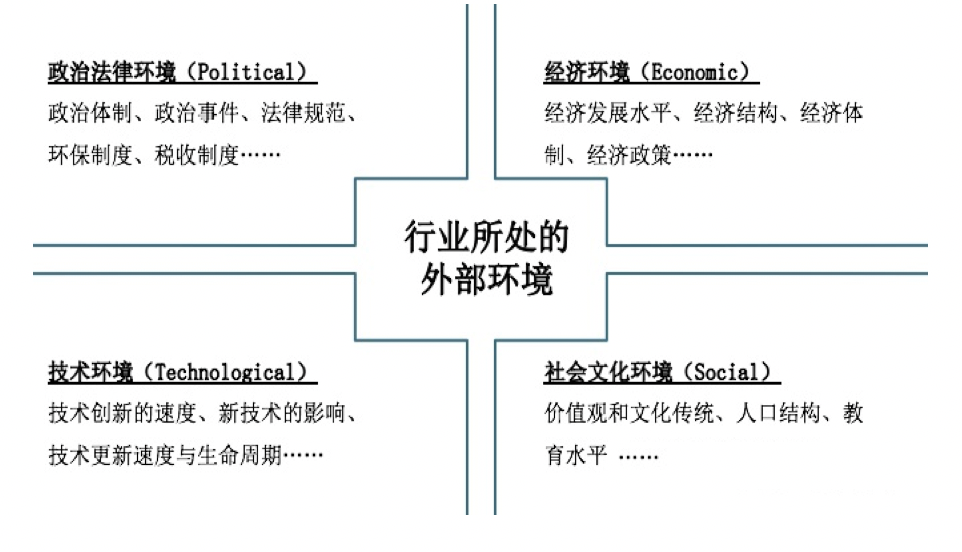

该分析法是指宏观环境的分析，在分析一个企业集团所处的背景的时候，通常是通过这四个因素来分析企业集团所面临的状况。

​	1.1 **政治环境（P）**主要包括：政治制度与体制，政局，政府的态度等；法律环境主要包括政府制定的法律、法规。

​	1.2 **经济环境（E）**主要包括：GDP、利率水平、财政货币政策通货膨胀失业率水平、居民可支配收入水平、汇率、能源供给成本、市场机制、市场需求等。

​	1.3 **社会（S）**主要包括：人口环境和文化背景，而人口环境主要包括人口规模、年龄结构、人口分布、种族结构以及收入分布等因素。

​	1.4 **技术（T）**主要包括：发明及企业市场有关的新技术、新工艺、新材料的出现和发展趋势以及应用背景。

#### 4.5  提出解决方案

具体的解决方案是需要根据上一步定位到的原因，比如我们在上一步定位到某一个渠道用户下降明显高于其他渠道，通过和该渠道负责人沟通了解到，该渠道拉新活动在7月15号结束了，从而导致该渠道DAU下降，针对这个原因，我们可以再策划其他的一些运营活动来提高该渠道用户活跃度

### 第五节 本章小结

接下来我来带大家一起回顾一下本章的知识点

首先我们学习了数据分析的定义，数据分析的主要工作：描述现状、发现规律、推动改进，以及数据分析的主要工作流程：需求分析、数据收集、数据处理、数据分析、数据可视化、数据分析报告

在第二节我们学习了数据分析方法论  做好数据分析的三个点：明确问题、拆解问题、定位问题，接着给大家介绍了常用的分析模型，包括用户生命周期模型、2A3R模型、RFM模型，最后给大家介绍了工作中比较常用分析方法，包括对比分析、趋势分析、矩阵关联分析、分组分析、漏斗分析、细分分析方法等

在第三节给大家介绍了常用的业务指标，主要包括两大类：产品运营指标、商业分析指标

在第四节通过DAU数据异常的案例给大家讲解了当我们面对一个具体问题时如何进行分析

通过本章课程的学习之后，相信大家对数据分析有了基本的了解和认识、对数据分析常用的分析方法和模型有了基本的认识和领会，会为接下来的学习会奠定一个良好的基础！
