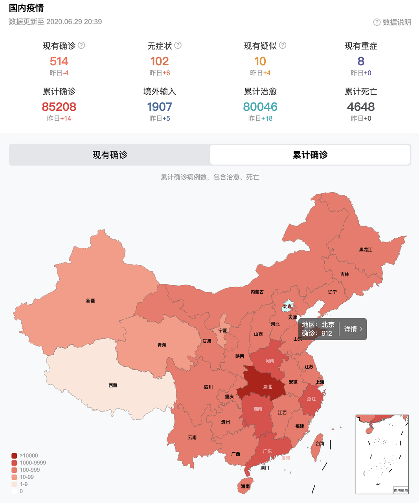
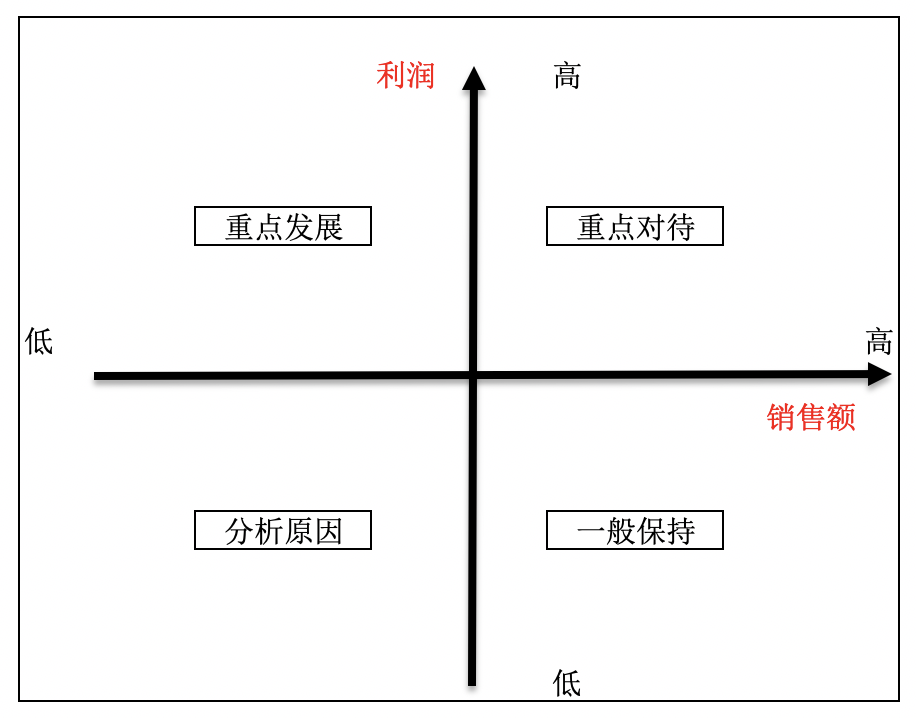
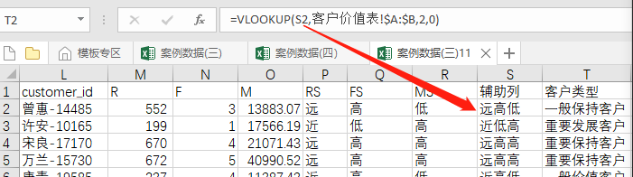

## 第一章  数据分析思维与业务流程

课程主要内容

- 第一节：数据分析概述
- 第二节：数据分析方法论和分析模型
- 第三节：数据分析业务指标
- 第四节：实战案例讲解
- 第五节：本章小结

————————————————————————————————————

### 第一节  数据分析概述

#### 1.1 数据分析是什么

数据分析是在立足于业务的基础上，通过数据收集、清洗、处理、分析、建模、展示等方式，用于监控业务状态，分析方案效果，定位业务问题，最终实现优化业务，辅助决策制定的行为。

#### 1.2 数据分析师做什么

- 实时疫情数据展示

通过上述图表，大家可以很快掌握疫情发展态势如何？哪些地方疫情严重？正在好转还是正在恶化？

- 电商用户画像

大家可能听说过电商杀熟。现阶段，分析用户构成，为不同类型用户差异化定价，是电商提高收益的重要手段。

- 金融风险评估     

​		大家可能都开过信用卡，会发现每个人能申请的信用卡额度都会有一些差异，特别用卡时间越久，额度差异越大。这就是银行利用用户的消费习惯设计还款风险模型，给容易选择分期还款的人增加额度，这样可以增加银行收益；但是也衡量用户还款能力，避免坏账。这就是金融风险数据分析。

那说了这么多，数据分析师到底在做什么呢？，总结起来有以下三个方面：

- 描述现状。
- 发现规律。
- 推动改进。

#### 1.3 数据分析主要流程

数据分析的主要流程可以总结为以下六个步骤：

1. 需求分析。

2. 数据收集。

3. 数据处理。

4. 数据分析。

5. 数据可视化。

6. 数据分析报告。

   

下面我们针对每个步骤详细介绍一下：

1. 需求分析

对需求进行分析和拆解是整个数据分析流程的首要环节，也是确保数据分析过程有效性的必要条件,可以为数据收集、处理、分析数据提供清晰的目标。

2. 数据收集

按照确定的数据分析框架，收集相关数据的过程，它为数据分析提供了素材和依据。这里所说的数据包括第一手数据与第二手数据，第一手数据主要指可直接获取的数据，第二手数据主要经过加工整理后得到的数据。

具体一点数据可以使我们业务数据，可以是我们的APP打点行为数据，也可以是第三方爬取数据，也可以是公开的市场数据。

我们后面的课程中涉及到的：Mysql数据查询，Hive的数据查询，爬虫 （Python) 都是数据收集的方式.

3. 数据处理

数据处理的基本目的是从大量的、杂乱无章、难以理解的数据中。抽取并推导对解决问题有价值、有意义的数据。

数据处理主要包括数据清洗、数据转化、数据提取、数据计算等处理方式，一般拿到手的数据都需要进行一定的处理才能用于后续的数据分析工作，即使再"干净"的原始数据也需要先进行一定的处理才能使用。

名词术语 ETL：EXTRACT(提取)、Transform(转换)、LOAD(加载);  这个就是指的数据处理。

4. 数据分析

数据分析是基于业务的问题，用适当的统计分析方法，分析模型对收集来的大量数据进行分析，将它们加以汇总和理解并消化，以求最大化地开发数据的功能，发挥数据的作用。

数据分析不仅仅需要对业务的深入理解（要有业务思维能力），也需要了解统计分析方法和分析模型（方法论），也需要借助各种工具，编程的使用。

5. 数据可视化

一般情况下，数据是通过表格和图形的方式来呈现的，我们常说用图表说话就是这个意思。常用的数据图表包括饼图、柱状图、条形图、散点图、雷达图等，当然可以对这些图表进一步整理加工，使之变为我们所需要的图形，例如金字塔图、矩阵图、漏斗图、帕雷托图等。

人们更愿意接受图形这种数据可视化方式，因为它更高效、直观地传递出分析师所要表达的观点。在一般情况下，能用图说明问题的就不用表格，能用表格说明问题的就不用文字。

我们后面的课程中涉及到可视化的工具：tableau， 神策数据平台，quick bi

6. 数据分析报告

一份好的数据分析报告，首先要有明确的结论，没有明确结论的分析称不上分析，同时也失去了报告的意义；

其次需要有一个好的分析框架，逻辑清晰，层次分明，能够让阅读者一目了然；

最后，在展示形式上应该图文并茂，可以令数据更加生动活泼，提高视觉冲击力，有助于阅读者更形象、直观地看清楚问题和结论，从而产生思考。

最后的最后：

数据分析师的核心目的是利用数据分析结论推动业务更好地发展；

所以，在产出报告之后，数据分析师还需要通过推动运营、产品、开发团队，将报告的建议进一步的变成实际的业务优化策略，或者是辅助策略制定。

**最后一个小节我们会带着大家一起做一个具体案例：某在线教育公司DAU近期出现异常波动，面对这个问题，作为数据分析师该如何进行分析呢？**

**要解决这类问题，我们需要掌握常用的数据分析方法论和业务分析模型**

### 第二节  数据分析实战

#### 2.1 某线下连锁水果店销售数据分析

##### 2.1.1 案例背景

2020年上半年的疫情几乎对所有实体行业都产生了巨大的影响。为更好更快地度过难关，某线下连锁水果店急需找到一些可以稳住整体利润的方案。

##### 2.1.2 问题确认与指标拆解（业务逻辑图）

之后，我们通过与老板沟通，得知现有的目标有两个：

次月净利润：xxxx万

次月流水：x亿

我们分析，提高销售利润有三个方案：

1.提高卖得好的品类的进货量；

2.减少卖得不好的品类的进货量；

3.优化销售店面；

同时，在考虑提高进货量时，我们需要以水果的需求变化作为进货量的参考。

所以我们的分析方案为以下几种：

1.找出销量好的和利润高的品类；

2.预测水果销量，通过销量计算各品类后续进货量；

3.分析各店面销售情况，找出销售额较落后的店面，做店面的调整规划2.1.3 问题解决思路（流程图）

##### 2.1.4 实际方法应用

###### 2.1.4.1 运用对比分析法解决哪类产品销售好的问题？

- 需求确认

  明确数据中需要比较的指标，何种方式比较，什么指标之间比较。

- 数据收集

  依据业务指标和计算口径，进行数据收集。

- 数据处理：统计（excel 工具实现）

  知识点：excel 去重筛选   

  1.【数据】-->【高级筛选】-->选择“将筛选结果复制到其他位置”，列表区域选中D列，

​     指定复制到的位置，勾选“选择不重复记录”。

  	 2.统计各品类的总销售量（sumif(范围，条件，求和项）

   	3.设施统计表格格式（字体，背景色等）

- 数据分析： 对比分析（图表更直接----可视化）
- 知识点：为各品类绘制对比图（柱形图）
  1. 选中左侧所有数据 -->【插入】--> 图表区域选择柱形图。

2. 选中图表右键添加数据标签（Excel 右侧可以设置图标样式）。

3. 问题扩展：计算每天的总销售额，每单的总销售额。

   

###### 2.1.4.2 对各品类进行分组找到销量额和利润都低的品类---矩阵关联法(象限分析法)

​    矩阵分析法:是指将事物的两个重要指标作为分析的依据，进行分类关联分析，找出解决问题的一种分析方法，也称为矩阵关联分析法，简称矩阵分析法。

1.  每次营销活动的点击率和转化率

2. 各类服装库存与销量

3. 用户对产品重要性与满意度

 作用：1. 将有相同特征的事件进行归因分析，总结其中的共性原因

​         2. 建立分组优化策略

- 需求确认：

​       指标体系（销售额，销售量 ，毛利润等）

​       销售额高和平均利润都高：重点对待

​       销售额高但是平均利润少：一般保持

​       销售额低但是平均利润高：重点发展

​       销售额和平均利润双低：需要查明原因或下架或辅助重点发展的品类

- 数据收集:

​       依据确认的指标和计算口径获取数据

 

- 数据处理： 统计（excel 工具实现） 

​    1. 计算每单各水果的 利润=销售额- 成本 * 销售量

2. excel 去重筛选所有品类   数据菜单--高级筛选

3. 统计销售额（sumif)  

4. 统计总销量(sumif)

5. 统计总利润(sumif)

​    6. 计算平均利润

​         

 

- 数据分析： 象限分析（图表更直接----可视化）

​       知识点：象限图（散点图改进）

1. 选中销售额和平均利润数据绘制散点图

2. 计算销售额与平均利润的平均值

   

3. 调整散点图的X,Y轴交叉点为销售额和利润的均值，之变为矩阵图

   

4. 去掉散点图的X,Y轴刻度    

5. 选中横纵网格线，按下“del”键删除网格

6. 添加坐标轴的标题，便于区分各象限的含义

7. 设置数据标签

​     a.选中图表右键"添加数据标签"

​     b.选中标签右键“数据标签选项”--选中单元格的值并框选所有产品类目，去掉Y值

8. 最终展现结果如下

9. 可以看出芒果的销售额、利润都不高，可以将精力放到其他 芒果的销量上

10. 小结

​      只要两个指标之间线性无关且放在一起有意义都可以用象限分析    

​      如：转化率和客单价   

​          售罄率和单款产出     

​          单款库存深度(数量）和 上新款数    

###### 2.1.4.3 运用趋势分析法分析水果总需求如何？

​    趋势是市场表现的方向，趋势分析可以帮助我们把握市场大方向，不犯原则性错误。

​    趋势有三种方式：上升，下降和平稳  

​    纵向分析:不同时间的段指标进行比较

- 需求确认：

​	比较的指标：订单量 ，重量， 销售额  

​	比较的时间粒度： 时，天，月，年

- 数据收集：

  依据确认的指标和计算口径

  数据处理： 统计（excel 工具实现）

1.数据量少的情况下，我们选择时间粒度为日。excel 去重筛选所有时间段 

【数据】-->【高级筛选】--> 列表区域选择日期列

   

   2.统计每天的销售量并设置表格式 （sumif(范围，条件，求和项)）              

- 数据分析： 趋势分析（图表更直接----可视化）-- 时间段趋势用折线图表示

  1.【插入】-->【图表区】--> 选择“带数据标记折线图”（时间段少时用）

   2.选中图表对象，右侧菜单设置图表进行美化

   3.问题扩展 

- 分析4月第一周各类水果的需求情况
- 计算每日的客单价  客单价 = 总销售额/订单数

######  2.1.4.4 销售团队4月销售情况分析---分组分析（分布情况）

- 需求确认： 

  对各销量段的人数做对比  确定几个销量段(组数），各段如何划分

- 数据收集：

  依据确认的指标和计算口径

- 数据处理： 统计（excel 工具实现）

  1. 确定组数后计算组距：（最大值-最小值）/ 组数

2. 最小值和组距设计组

​           

3. 计算各组频数（countif,frequency)--重叠组上限不在内。

- 数据分析：分组分析（图表更直接----可视化）

  1. 设计好组名  字符串连接 公式如： D12 &  "~"  &E12

  2. 选中组名和频数两列数据 插入--“图表区”的柱形图

##### 2.1.5 结论

通过对比各品类水果销量，发现葡萄、荔枝、香蕉销量较好；其中，香蕉、荔枝的利润超过平均利润，提高这两类水果的进货量可以有效提高整体的利润；葡萄虽然利润稍低，但是销量较高，可以有效带动总体利润额；

通过趋势分析可以预估xxx品类的未来销量，从而指导进货情况。

#### 2.2 培训班数据分析

##### 2.2.1 案例背景

近期我们这个培训班的销售额增长，但是利润下降，需要查找原因，优化渠道，并提出更长远的方案，提高利润；

我们主要采取几个方向：

增加利润方案：

1.提高高利润流量投放；

2.优化现有的产品设计，减少学员在转化过程的流失；

2.提高现有学员转化；

减少支出方案：

1.优化部分岗位匹配不佳的培训讲师，节省成本。

##### 2.2.2 问题确认与指标拆解（业务逻辑图）

##### 2.2.3 问题解决思路

##### 2.2.4 实际方法应用

###### 2.2.4.1 数据涨跌异动分析---问题拆解（逻辑树）

 

- 发现异常（销售额是上升的，但毛利额却在下降）

  确定问题： 周同比， 月同比，年同比

   从图示得出8月毛利润出现异常，确认问题不属于正常波动。        

- 确定原因：逻辑树问题拆解

  1. 问题拆解

2. 产品较多我们从渠道类型出发（发现8月数据免费渠道是销售额高但利润低）

3. 下钻免费渠道内的明细渠道（发现8月数据流量宝是高销售额低利润的）

4. 调取流量宝明细与其他部门配合解决此问题

###### 2.2.4.2 渠道排名---综合分析

​    渠道的数量指标(访问数，页面浏览数）

​    渠道的质量指标(ROI，到达率，跳出率，页面停留时间，浏览深度，用户访问频数)

- 需求确认：

  确认要考察的指标及计算口径

​    

​	目标优化矩阵方式确认指标权重

​          

- 收集数据：

  依据指标体系及计算口径收集数据

- 数据处理：

  数据标准化（去除量纲影响）

​    

- 数据分析 

  1. 利用指标权重和标准化后数据计算综合得分（ MMULT(数据范围1，数据范围2)）

2. 对各渠道进行排名（rank(数据，数据范围)）

###### 2.2.4.3 分析培训班的各环节转化情况---产品用户行为分析(漏斗分析）

*上个分析有具体到各个渠道的分析，但是这个分析里没有渠道数据；是整体数据的分析；

1.硬讲

2.做出具体渠道的数据

- 需求理解：

  1. 确定各环节及各环节计算口径

     环节： 浏览（浏览时长大于30秒的）

  ​       申请试听（电话联系确认时间）

​              试听（试听时间20分钟）

​              报名（合同签订）

2. 确定计算各环节转化率或总转化率

3. 时间窗口是 ：根据业务实际情况来，可以天 周  月等           

- 数据收集：

  依据确认的指标和计算口径

- 数据处理： 统计（excel 工具实现）

  1. 计算各环节人数计算公式如下图

2. 计算各环节转化率

​     

- 数据分析： 漏斗分析（图表更直接----可视化）

  由于漏斗图不能选择绘图数据外的数据作为数据标签，所以选择堆积条形图。

  1. 计算在人数前占位符

2. 选中各环节 占位 人数及数据后“插入”菜单--图表--“堆积条形图”
3. 选中Y轴右键“设置坐标轴格式”---勾选“逆序类别”

   

4. 选中人数（橙色）条形图右键“添加数据标签”，数据标签右键"设置数据标签格式”---勾选“单元格中的值”---选中“各环节转化率”的数据

   

5. 选中蓝色条图右键“填充”--选择无填充

6. 最终漏斗图

   常见问题：最终指标与实际不一样: 有其他路径到达报名（如口碑介绍）

​     

###### 2.2.4.4 学员价值分析---RFM建模

- 需求确认：

  用户划分几类， 时间窗口期， R的单位是月/日

  R确定几个阶段， F确定几个阶段， M确定几个阶段

- 数据收集：

  根据用户的窗口期收集订单数据（用户ID， 订单日期，订单金额）

- 数据处理：

  窗口期我们定义为2018-2019 两年，对数据进行筛选

  1. 选中第一行列头 ，点击“数据“菜单--“筛选” 对order_date 选中2016-2017两年的数据，

2. 选中2016,2017的数据把这两年的数据删除掉

   

   从数据看出，现在是订单详情数据，一个单子有多个商品，首先要对订单进行数据汇总

1. 订单数据汇总（order_id, order_date,coustomer_id,sales）

   【数据】-->【高级筛选】 --> 筛选出去重的订单号

2. 通过vlookup指令，以Order_id 找到其对应的 order_date和customer_id

3. 通过sumif 指令， 以Order_id 汇总其对应的 Sales 之和

- 数据分析：

  【数据】--> 【高级筛选】 --> 筛选出去重的customer_id

1. 计算用户最后一次购买距离2019-12-31号有多少天(date,minifs)

2. 计算两年内各用户购买的频次（countif）

3. 计算两年内各用户购买的总金额（sumif）

   RFM模型3各指标，每个指标分为两个阶段，以均值作为分割点，计算均值（average）

1. 把各用户的R，F，M指标分别分为 R(远近） F(高低）  M(高低）以均值为界限（if）

2. 便于查找，在各用户后和价值表处分别加上复制列(&）

3. 从价值表中为用户获得用户类型（vlookup）

   从上图可以看出每个用户的类型就划分好了，2*2*2 八类用户，可以根据需求划分更多类型

结果产出： 

用户类型表单 +  用户类型占比图

   

###### 2.2.4.5 搭建培训讲师岗匹配模型---搭建指标体系模型

​	建立招聘信息模型，使招聘更规范化，对岗位需求更具有针对性。

​	公司计划招聘一名数据分析师，根据岗位需求确定基本信息(工作年限，学历） 技术能力(Python,Sql) 业务能力（运营，产品知识）

- 设计指标取值及分值口径

  确定指标体系后确定指标口径，这指标取值对应的分值。

- 确定指标权重及判断结果

  各指标在整个体系中重要程度有所差异，所以要确定指标权重，并创建结果判断标准。

- 数据输入规范设置

  在数据交互区域“输入值”一行，依据指标字典设置相应的数据有效性

  1. 选中“B4” 点击 “数据”菜单---“数据验证” 为B4单元格加工作年限的输入录入限制  。

2. 设置单元格序列验证后单元格样式如下，其他指标验证实现方式一致。

   在数据结果区“分值”一行，依据指标值和指标字典得相应的分值

1. vlookup("1-3",工作年限和分值范围，范围分值列，精确查找)  其他各指标实现方式一致

   在数据结果区“权重后得分” 进行相应指标权重 * 分值计算

1. 工作年限1-3年得分2 * 工作年限权重0.15 为 工作年限的权重后得分，其他各指标计算方式一致

   对指标体系3部分分别进行 权重后得分求和计算

1. 对B11:E11基本情况下各指标权重后得分求和，技术能力和业务能与其计算方式一致

   计算综合得分，并显示判断结果

1. 对三部分总分 sum(B12:K12) 用if进行结果判断

##### 2.2.5 结论

1.XXX渠道表现较好，应该加大该渠道投放；XXX渠道表现较差，可适当减少投放；

2.

3.

4.

### 第三节 本章小结

接下来我来带大家一起回顾一下本章的知识点

首先我们学习了数据分析的定义，数据分析的主要工作：描述现状、发现规律、推动改进，以及数据分析的主要工作流程：需求分析、数据收集、数据处理、数据分析、数据可视化、数据分析报告

在第二节我们学习了数据分析方法论  做好数据分析的三个点：明确问题、拆解问题、定位问题，接着给大家介绍了常用的分析模型，包括用户生命周期模型、2A3R模型、RFM模型，最后给大家介绍了工作中比较常用分析方法，包括对比分析、趋势分析、矩阵关联分析、分组分析、漏斗分析、细分分析方法等

在第三节给大家介绍了常用的业务指标，主要包括两大类：产品运营指标、商业分析指标

在第四节通过DAU数据异常的案例给大家讲解了当我们面对一个具体问题时如何进行分析

通过本章课程的学习之后，相信大家对数据分析有了基本的了解和认识、对数据分析常用的分析方法和模型有了基本的认识和领会，会为接下来的学习会奠定一个良好的基础！